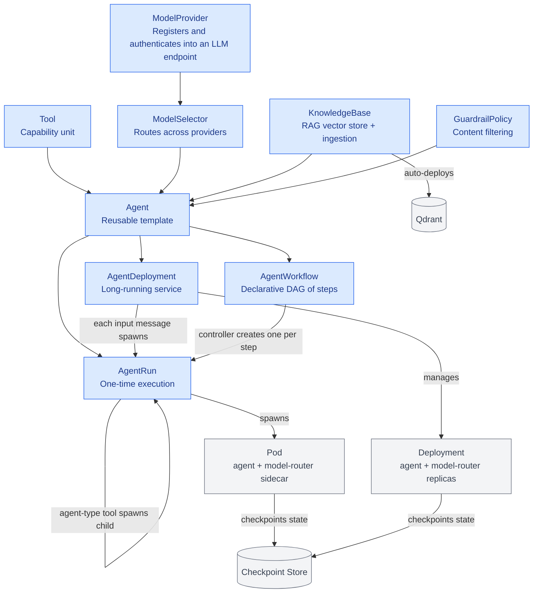

# Agent Orchestrator (agent-orc) 


[](https://go.dev/)
[](https://github.com/floppyfish14/agent-orc/actions/workflows/test.yml)
[](https://github.com/floppyfish14/agent-orc/actions/workflows/lint.yml)
[](https://github.com/floppyfish14/agent-orc/actions/workflows/test-e2e.yml)
[](LICENSE)
[](https://github.com/floppyfish14/agent-orc/releases)

Agent Orchestrator is a Kubernetes-native platform for deploying, managing, and running AI agents at scale. It lets you declaratively define agents, route them to the right LLM, equip them with tools, and execute them as one-off jobs or long-running services — with checkpoints, cost tracking, guardrails, and RAG built in.

> **Open source, Apache 2.0.** See [CONTRIBUTING.md](CONTRIBUTING.md) to get started,
> [CODE_OF_CONDUCT.md](CODE_OF_CONDUCT.md) for the community standard, and
> [SECURITY.md](SECURITY.md) for how to report vulnerabilities.

---

## Quick Start

From zero to a chatting agent on your laptop in ~3 commands:

```bash
kind create cluster --name agent-orc-dev   # 1. local Kubernetes
export OPENAI_API_KEY=sk-...               # 2. one model-provider key
skaffold dev -p dev                        # 3. builds images + deploys the stack
```

Leave that terminal running — it watches for file changes and rebuilds automatically. Then drive an agent:

```bash
./hack/test-agents.sh run --watch          # creates an AgentRun and runs it
```

**Quick-start prerequisites:** [`kind`](https://kind.sigs.k8s.io/docs/user/quick-start/#installation), [`kubectl`](https://kubernetes.io/docs/tasks/tools/), [`skaffold`](https://skaffold.dev/docs/install/), [Docker](https://docs.docker.com/get-docker/) running, and an API key for at least one model provider (OpenAI, Anthropic, Google, or **Poolside**; providers are [LiteLLM-compatible](https://docs.litellm.ai/docs/providers)).

**What you get (local ports forwarded by the `dev` Skaffold profile):**

| Port | Surface | Purpose |
|------|---------|---------|
| `8080` | UI (via UIProxy BFF) | React UI + `/api/deployments/...` chat endpoints |
| `8000` | ACP API | Agent discovery, manifest introspection, self-service run execution |
| `8084` | External Task API | Programmatic task submit/poll/stream/cancel (OAuth2 / federated OIDC / K8s SA) |

> The operator's internal **UI API listens on 8083** and is cluster-internal — in local dev it's fronted by the UIProxy on `8080`. See [docs/ui-proxy.md](docs/ui-proxy.md) and [docs/auth.md](docs/auth.md).

### Detailed walkthrough

The `dev` profile builds all images (operator, model-router, MCP-ingester, UI, UIProxy) and deploys the full stack to the `agent-orc-system` namespace via the Helm chart + the `model-providers` chart. It forwards `8080`/`8000`/`8084` to localhost and creates `ModelProvider` + `ModelSelector` CRs for OpenAI, Anthropic, Google, and Poolside, taking each key from your shell env (never committed). First run takes ~2 minutes.

```bash
# 1. Create a local cluster
kind create cluster --name agent-orc-dev

# 2. Start development (builds, deploys, forwards ports — leave running)
export OPENAI_API_KEY=sk-...your-key-here...
skaffold dev -p dev

# 3. Test agent execution
./hack/test-agents.sh run --watch

# 4. Run a demo (optional)
skaffold run -p demo-soc-triage      # security-operations triage demo
skaffold run -p demo-htb-pwn         # autonomous red-team pwnbox (privileged)
skaffold run -p demo-llm-research    # arxiv research agent
skaffold run -p demo-financial-analysis

# 5. Clean up
kind delete cluster
```

> The test agent and demos run from `ghcr.io/agentorc/agent-orc/openai-reference:latest` (pulled
> from GHCR; no credentials needed; offline? `docker build -t …:latest -f examples/agent-sdk-template/Dockerfile . && kind load docker-image …:latest --name agent-orc-dev`).

> Need Ollama/local models, a static Redis password, or the privileged HTB pwnbox? See the profile headers in [skaffold.yaml](skaffold.yaml) and [docs/local-model-selection.md](docs/local-model-selection.md). For faster UI iteration you can also use the provided **devcontainer** (`.devcontainer/`, ships Docker-in-Docker + kind) — open the repo in VS Code/Codespaces and run the steps above directly.

If you'd rather read before running, the in-depth developer guides are linked in the [Documentation](#documentation) table below — start with [Development Guide](docs/development.md), [Integrating with agent-orc](docs/integrating.md), [aoctl CLI Reference](docs/aoctl-reference.md), and [Cost Tracking](docs/cost-tracking.md).

---

## Documentation

In-depth guides, organized by audience. **Developers** start with the first block; **Operators** with the CRD/auth/observability rows.

| Doc | Audience | What it covers |
|---|---|---|
| [Development Guide](docs/development.md) | Developers | Project structure, build/test commands, critical rules, devcontainer |
| [Integrating with agent-orc](docs/integrating.md) | Developers / integrators | End-to-end integration (CLI, SDKs, ACP API, observability) |
| [Agent Images](docs/agent-images.md) | Developers | What an agent image must do; framework tiers, injected env vars, built-in tools |
| [aoctl CLI Reference](docs/aoctl-reference.md) | Developers | Complete `aoctl` command reference |
| [ACP API](docs/acp-api.md) | Developers | Agent discovery, manifest introspection, self-service run execution |
| [OpenAPI Spec](docs/openapi-spec.md) | Developers | External Task API + ACP API machine-readable contracts |
| [AgentWorkflow](docs/agentworkflow.md) | Developers | Declarative DAG orchestration |
| [RAG / KnowledgeBase](docs/rag.md) | Developers | Vector store integration and built-in tools (`_rag_search`, `_rag_ingest`) |
| [MCP Access Control](docs/mcp-access-control.md) | Developers / Operators | MCP server security and tool exposure |
| [Local Model Selection](docs/local-model-selection.md) | Developers | Running with local/Ollama models via LiteLLM |
| [AI Task Testing](docs/testing-tools.md) | Developers | Test agents, evals, and the `hack/test-agents.sh` harness |
| [UI Testing](docs/ui-testing.md) | Developers | Running UI unit/e2e (Vitest + Playwright) tests |
| [Rate Limiting](docs/rate-limiting.md) | Operators | Per-tenant quotas, budget enforcement, HTTP 429/402 responses |
| [Cost Tracking](docs/cost-tracking.md) | Operators | How LLM spend is measured, persisted, and budgeted |
| [Observability](docs/observability.md) | Operators | Health probes, Prometheus metrics, audit logging |
| [Egress Sinks](docs/egress-sinks.md) | Operators | Kafka/PubSub/Redis result delivery, AgentDeployment input sources |
| [CRDs](docs/crds.md) | Operators | All CRD definitions and field references |
| [Authentication](docs/auth.md) | Operators | OAuth2, OIDC, ServiceAccount, trust model |
| [Enterprise Integration](docs/enterprise-integration.md) | Enterprise | End-to-end enterprise setup (tenants, webhooks, guardrails, KBs) |

---

## Architecture

### Component Relationships



`AgentPod` = an agent container + a **model-router sidecar** (the LLM proxy that owns provider selection, token streaming, spend accounting, and checkpointing) + an optional **tool-executor sidecar** (dispatches tool calls, including child agents). See [docs/crds.md](docs/crds.md) for detailed CRD documentation.

---

## Core Concepts

### Custom Resource Definitions (CRDs)

**Agent** - Defines a reusable agent template
- References a ModelSelector for LLM routing
- Lists available Tools
- Specifies runtime (OCI image + framework)
- Optional system prompt and memory config

**AgentRun** - One-time execution of an Agent
- Single input task with output
- Terminal lifecycle (Pending → Running → Succeeded/Failed)
- Tracks checkpoints for conversation state
- Supports restart policies and callbacks

**AgentDeployment** - Continuous, long-running agent service
- Manages pod replicas
- Auto-restarts on failure with exponential backoff
- Tracks consecutive failures and pauses if threshold exceeded
- Supports multiple input sources: `chat` (API-driven), `queue` (Redis), `pubsub` (Kafka), `loop` (self-managed)
- Persists conversation state via checkpoints; warm-pool pod reuse for low-latency chat

**ModelProvider** - Registers an LLM endpoint
- LiteLLM model string (OpenAI, Anthropic, Google, Ollama, Bedrock, etc.)
- Optional `baseURL` for self-hosted providers
- Credentials reference (K8s Secret; mounted directly by the model-router sidecar — the operator never reads it)
- Capabilities tags (`reasoning`, `code`, `vision`, `fast`, `long-context`, `cheap`) used by the rule-based router
- Constraints: `contextWindow`, `maxOutputTokens`, `maxRequestTokens`, `costPerMillionInputTokens`, `costPerMillionOutputTokens`
- `latencyProfile`: `fast` / `medium` (default) / `slow`

**ModelSelector** - Routes LLM calls to providers
- Routing strategy: `rule-based`, `llm-meta`, or `hybrid`
- Weighted provider selection
- Capability-based routing (e.g. `code` → GPT-4o, `reasoning` → Claude)
- Budget caps and fallback chains

**Tool** - Capability available to agents
- Type: `regular` (OCI), `agent` (orchestrator), `mcp` (Model Context Protocol), `wasm`
- Execution mode: `pod` (per-call, maximum isolation), `sidecar` (in-agent-pod, stateful), `wasm` (sandboxed module)
- JSON schema for input/output
- Network egress rules, resource limits, cloud identity

**KnowledgeBase** - Vector store-backed RAG (Retrieval-Augmented Generation)
- Auto-deploys a Qdrant instance per namespace
- Embedding + chunking pipeline for documents
- Built-in `_rag_search` and `_rag_ingest` tools injected into agents
- Supports ConfigMaps, URLs, S3, and MCP-server fetches as document sources

**GuardrailPolicy** - Content filtering rules for agent inputs/outputs
- Input filters: validate user messages before reaching the LLM
- Output filters: validate LLM responses before reaching the caller
- Filter types: regex (redact/pattern match), keyword-blocklist, topic-validation
- Actions: redact, block, warn

**MCPServer** - Model Context Protocol server integration
- Declares tools from external MCP servers
- Auto-creates child Tool resources for each declared tool
- Supports `stdio` (sidecar), `http`, and `sse` transports
- Built-in access control via `allowedAgents` list

**TenantConfig** - Enterprise authentication and authorization
- OAuth2 client credentials or federated OIDC (Auth0, Okta, etc.)
- Namespace-scoped resource access control
- Rate limiting and daily budget caps
- Used by the ACP API for external integrations

**AgentWorkflow** - Declarative DAG orchestration
- Steps with dependencies (CEL conditions)
- Budget caps across all steps
- Adaptive step proposals from agents
- Creates AgentRuns for each step

### How session state works (two layers)

agent-orc keeps two layers of state, both backed by the same Redis `state.Store` (`internal/state`):

1. **Run state** — the model-router's per-run conversation checkpoint, keyed `agentorc/runs/<run>/state` and persisted in `internal/state/store.go`. Stores:
   - messages (`SaveMessages`/`LoadMessages`, zstd-compressed `[]json.RawMessage` with a TTL),
   - cumulative spend (`SaveSpend`/`LoadSpend`, keyed `…/state:spend`) — so cost survives pod crashes,
   - per-token + trace-event streams (`SaveToken`/`SaveTraceEvent`/`TailTokens`) for live streaming,
   - ephemeral key/value (`SaveKV`/`LoadKV`) used for episodic summaries,
   - a short-lived cancel flag (`SignalCancel`/`IsCancelled`).
   The store is a **shared singleton**: the `Router`, `ACPServer`, `UIServer`, `ExternalAPIServer`, `AgentRunReconciler`, and `Executor` all reference the same instance, so every component sees the same bytes. On cold start (`router.New()`) and on warm-pool reuse (`ClaimRun` → `PriorRunRef`) the router reloads prior spend and prior messages, so a resumed run picks up where it left off.
2. **Chat-session checkpoint** — used by the UI's chat API (`POST …/execute` → `POST …/complete` → `GET …/history`). The `internal/checkpoint` Store persists a `Checkpoint{SessionID, Version, ConversationHistory, LastRunRef, Metadata{TotalCostUSD,…}}`, backed by Redis when a state backend is configured, else an in-memory store. Each message increments `Version`, and runs chain across turns via `LastRunRef`↔`PriorRunRef` (the model-router turns `PriorRunRef` into its `ResumeCheckpointKey` = `agentorc/runs/<prior-run>/state` to reload context).

The conversation buffer is **hard-capped, not unbounded**: `priorMessages` is folded and truncated to `checkpointBudget()` (80% of the largest provider's `contextWindow`, see `ContextWindowReserve`) on each turn, and prior turns are condensed into an **episodic summary** (`maybeRunEpisodicSummary`) that replaces the collapsed turns in memory and is persisted to the `episodic:<run>:<n>` KV scope. See [docs/cost-tracking.md](docs/cost-tracking.md) and [docs/redis.md](docs/redis.md).

---

## API Endpoints

agent-orc exposes three HTTP surfaces. Pick the right one for your integration:

| Surface | Port | Purpose | Auth |
|---------|------|---------|------|
| **External Task API** | **8084** | Programmatic task submit/poll/stream/cancel | OAuth2 JWT / federated OIDC / K8s SA (`POST /oauth/token`) |
| **ACP API** | **8000** | ACP-compatible agent discovery + run execution | Same bearer token as 8084 |
| **UI API** | **8083** (cluster-internal) | React SPA chat proxy + deployment management; fronted in dev by the UIProxy BFF (`:80` → localhost:`8080`) | session token (cluster-internal) |

For production, expose 8084 (and optionally 8000) behind an Ingress/Gateway.
The UI API (8083) stays cluster-internal behind the UIProxy Backend-for-Frontend
(see [docs/auth.md](docs/auth.md) and [docs/ui-proxy.md](docs/ui-proxy.md)).

### Observability endpoints (all external surfaces)

```bash
curl http://localhost:8084/healthz
curl http://localhost:8084/readyz
curl http://localhost:8084/version
curl http://localhost:8084/metrics   # Prometheus format: requests_total, auth_failures_total, ...
```

### External Task API (recommended for integrations)

The External Task API ([docs/enterprise-integration.md](docs/enterprise-integration.md),
contract: `GET /openapi.json`) lets external systems submit tasks, poll/stream
results, answer clarification questions, and receive webhook callbacks — without
managing Kubernetes resources.

```bash
# 1. Obtain an access token (client_credentials grant)
TOKEN=$(curl -s -X POST http://localhost:8084/oauth/token \
  -d "grant_type=client_credentials&client_id=acme-client&client_secret=secret123" \
  | jq -r .access_token)

# 2. Submit a task
curl -s -X POST http://localhost:8084/v1/tasks \
  -H "Authorization: Bearer $TOKEN" -H 'Content-Type: application/json' \
  -d '{ "agent": "support-bot", "input": "How do I reset my password?" }'

# 3. Stream results (SSE)
curl -N http://localhost:8084/v1/tasks/task-support-bot-abc123/stream \
  -H "Authorization: Bearer $TOKEN"
```

A CLI and Python/Go SDKs are available — see [docs/integrating.md](docs/integrating.md).

### ACP API — Agent discovery & self-service run

The ACP API (port 8000) lets callers discover which agents are available to
their tenant, inspect each agent's input/output schema and tools, and launch
runs — all without writing YAML or touching `kubectl`.

```bash
# 1. Discover available agents
curl -s http://localhost:8000/agents \
  -H "Authorization: Bearer $TOKEN"

# 2. Inspect an agent's manifest (schema, tools, knowledge bases, guardrails)
curl -s http://localhost:8000/agents/support-bot \
  -H "Authorization: Bearer $TOKEN"

# 3. Launch a run with schema-validated input
curl -s -X POST http://localhost:8000/agents/support-bot/run \
  -H "Authorization: Bearer $TOKEN" -H 'Content-Type: application/json' \
  -d '{ "input": [{"role":"user","parts":[{"content_type":"text/plain","content":"How do I reset my password?"}]}] }'

# Or use the CLI:
aoctl agents list
aoctl agents describe support-bot
aoctl agents run support-bot --input "How do I reset my password?"
```

---

## Deployment Execution (chat-style API, dev)

The UI API (`localhost:8080` via the UIProxy in dev) exposes a chat-style endpoint for long-running `AgentDeployment`s. A call to `execute` is **asynchronous**: it creates an `AgentRun` and returns a run name + session id; the agent runs in a pod and its output is persisted back by the runner.

```bash
# 1. Send a message (returns a run name + session id; creates an AgentRun)
RESP=$(curl -s -X POST http://localhost:8080/api/deployments/default/support-bot/execute \
  -H 'Content-Type: application/json' \
  -d '{
    "input": "Hi, I have a problem with my order",
    "sessionId": "customer-12345"
  }')
echo "$RESP"   # → {"runName":"chat-support-bot-xyz","sessionId":"customer-12345"}

# 2. Retrieve the conversation history for the session
curl http://localhost:8080/api/deployments/default/support-bot/history?sessionId=customer-12345
# → {"sessionId":"customer-12345","messages":[{"role":"user","content":"Hi, I have a problem with my order"}]}

# 3. Persist the agent's final answer for the run (called by the runner/pod)
curl -s -X POST http://localhost:8080/api/deployments/default/support-bot/complete \
  -H 'Content-Type: application/json' \
  -d '{
    "sessionId": "customer-12345",
    "output": "I'\''d be happy to help! What'\''s your order number?",
    "traceEntries": "..."
  }'
# → {"status":"ok"}
```

> The deployment SSE stream endpoint (`GET …/stream`) currently returns a placeholder and is not yet wired to live token streaming; real-time token streaming is emitted by the model-router sidecar into its `tokens:<namespace>:<run>` stream, and will be surfaced through this endpoint in a future release.

### Get Deployment Status

```bash
curl http://localhost:8080/api/deployments/default/support-bot

# Response
{
  "name": "support-bot",
  "namespace": "default",
  "agentRef": "support-agent",
  "phase": "Running",
  "readyReplicas": 2,
  "availableReplicas": 2,
  "consecutiveFailures": 0,
  "inputSourceType": "chat",
  "contextUsedTokens": 2048,
  "maxContextTokens": 16000,
  "lastUpdateTime": "2025-01-15T12:00:00Z",
  "message": "Reconciling"
}
```

---

## Example: Long-Running Support Bot

> This example uses the **openai reference image** `ghcr.io/agentorc/agent-orc/openai-reference:latest`
> — a minimal OpenAI-compatible agent that streams input to the model-router and returns the
> output. The model-router injects `systemPrompt`, `tools`, prior context, and built-in tool
> resolution, so this image needs no baked-in persona. Published with each release; pin to
> your release's tag (e.g. `v0.4.1`) for production, or use `:latest` for local/dev. To run
> your **own** persona/image, replace `ociRef` with your image and set `systemPrompt`/your
> `tools` — see [Agent Images](docs/agent-images.md) for the full contract.

```yaml
---
# 1. Register the LLM provider
apiVersion: agentorc.agentorc.io/v1alpha1
kind: ModelProvider
metadata:
  name: gpt4-provider
spec:
  litellmModel: "openai/gpt-4o"
  credentialsRef:
    name: openai-credentials
    key: api-key
  capabilities:
    - fast
    - reasoning
  constraints:
    contextWindow: 128000
    costPerMillionInputTokens: "3.00"
    costPerMillionOutputTokens: "15.00"

---
# 2. Create a router
apiVersion: agentorc.agentorc.io/v1alpha1
kind: ModelSelector
metadata:
  name: support-router
spec:
  strategy: rule-based
  providers:
    - name: gpt4-provider
      weight: 100

---
# 3. Define a support agent
apiVersion: agentorc.agentorc.io/v1alpha1
kind: Agent
metadata:
  name: support-agent
spec:
  modelSelectorRef: support-router
  tools:
    - lookup-order
    - refund-tool
  systemPrompt: |
    You are a helpful support agent for our e-commerce platform.
    Help customers with orders, refunds, and billing.
  runtime:
    ociRef: ghcr.io/agentorc/agent-orc/openai-reference:latest
    framework: openai-compatible

---
# 4. Deploy as a long-running service
apiVersion: agentorc.agentorc.io/v1alpha1
kind: AgentDeployment
metadata:
  name: support-bot
spec:
  agentRef: support-agent
  inputSource:
    type: chat
  replicas: 2
  restartPolicy:
    minBackoffSeconds: 5
    maxBackoffSeconds: 300
    maxConsecutiveFailures: 5
```

Then users chat with the agent across turns. Each `execute` call creates a new `AgentRun` chained to the prior one via `PriorRunRef`, so the model-router rehydrates the prior conversation from its Redis checkpoint:

```bash
# User message 1 — creates run chat-support-bot-aaa, returns runName + sessionId
RESP=$(curl -s -X POST http://localhost:8080/api/deployments/default/support-bot/execute \
  -H 'Content-Type: application/json' \
  -d '{"input": "Hi, I have a problem with my order", "sessionId": "customer-12345"}')

# (…the agent pod runs, then persists its answer…)
curl -s -X POST http://localhost:8080/api/deployments/default/support-bot/complete \
  -H 'Content-Type: application/json' \
  -d '{"sessionId":"customer-12345","output":"I'\''d be happy to help! What'\''s your order number?"}'

# User message 2 — same sessionId chains to the prior run; the agent remembers context
curl -s -X POST http://localhost:8080/api/deployments/default/support-bot/execute \
  -H 'Content-Type: application/json' \
  -d '{"input": "Order #ORD-789", "sessionId": "customer-12345"}'

# Conversation history for the session
curl http://localhost:8080/api/deployments/default/support-bot/history?sessionId=customer-12345
```

The agent pod can crash and restart — checkpoints (messages, spend, episodic summaries) are persisted to Redis, and on resume the model-router reloads them under `agentorc/runs/<run>/state` and chains context through `PriorRunRef`/`LastRunRef` (`ClaimRun` → `LoadMessages`).

---

## Testing & Development

### Quick Agent Testing

The `hack/test-agents.sh` script auto-generates agents with unique names, eliminating the need to manually create manifests for each test:

```bash
# Test an AgentRun (one-time execution)
./hack/test-agents.sh run --watch

# Test an AgentDeployment (long-running service)
./hack/test-agents.sh deploy --watch

# Just create an Agent (for manual testing)
./hack/test-agents.sh agent

# List all test resources
./hack/test-agents.sh list

# Clean up test resources
./hack/test-agents.sh cleanup

# Target a specific namespace
./hack/test-agents.sh run -n custom-ns --watch
```

The script generates unique agent names using timestamps (e.g., `test-agent-1234567`) and creates a fully functional agent that:
- Calls the model-router's OpenAI-compatible API at `http://localhost:8080/v1/chat/completions`
- Gets an LLM response via the configured ModelSelector routing
- Returns the LLM output as the agent result
- Uses a Python 3.12 slim image with `urllib` for HTTP requests
- Includes error handling and 5-second timeouts
- Configurable resource requests/limits

Use `--watch` to monitor resource status until completion (or Ctrl-C to stop).

**Example output:**
```bash
$ ./hack/test-agents.sh run
▶ Creating Agent 'test-agent-089000'
✓ Agent created: test-agent-089000
▶ Creating AgentRun 'test-run-089000'
✓ AgentRun created: test-run-089000
```

### Run the test suites

```bash
make test           # Go unit tests
make lint           # golangci-lint (v2)
make test-e2e       # Kubernetes e2e (needs a running cluster)
make test-ui        # UI unit/component tests (Vitest)
make test-ui-e2e    # UI end-to-end tests (Playwright)
```

## Development

[Skaffold](https://skaffold.dev/) is the standard way to run agent-orc locally. It builds all images, deploys via Helm, watches for file changes, and automatically rebuilds and redeploys only the affected component. For faster UI iteration, use the provided **devcontainer** (`.devcontainer/`, ships Docker-in-Docker + kind) — open the repo in VS Code/Codespaces and run the Quick Start directly.

Full command reference in [docs/development.md](docs/development.md): `make run`, `make manifests`, `make build`, `make build-model-router`, `make build-ui-proxy`, `make docker-build`, `make install`, `make deploy`, and more.
