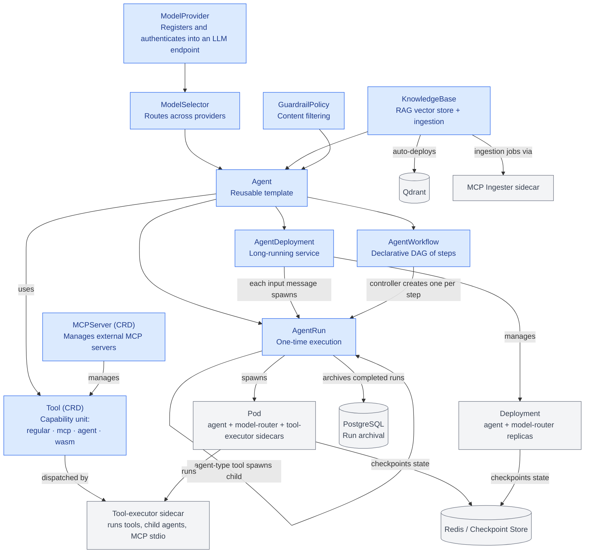

# Agent ORCAstrator
<p align="center">
  
</p>


[](https://go.dev/)
[](https://github.com/heddles/agent-orca/actions/workflows/test.yml)
[](https://github.com/heddles/agent-orca/actions/workflows/lint.yml)
[](https://github.com/heddles/agent-orca/actions/workflows/test-e2e.yml)
[](LICENSE)
[](https://github.com/heddles/agent-orca/releases)

Agent orcastrator is a Kubernetes-native platform for deploying, managing, and running AI agents at scale. It lets you declaratively define agents, route them to the correct LLM, equip them with tools, and execute them as one-off jobs or long-running services with checkpoints, cost tracking, guardrails, and RAG built in.

> **Open source, Apache 2.0.** See [CONTRIBUTING.md](CONTRIBUTING.md) to get started,
> [CODE_OF_CONDUCT.md](CODE_OF_CONDUCT.md) for the community standard, and
> [SECURITY.md](SECURITY.md) for how to report vulnerabilities.

---

## Quick Start

**Quick-start prerequisites:**
>__NOTE__: You need to activate mise in your shell for this to work. Here is an zsh example: `echo 'eval "$(mise activate zsh)"' >> ~/.zshr`
1. Install `mise` via Homebrew: `brew install mise`
1. Bootstrap the environment: `sudo mise install --system`
1. Ensure Docker is running.
1. Have an API key for at least one model provider (OpenAI, Anthropic, Google, or **Poolside**; providers are [LiteLLM-compatible](https://docs.litellm.ai/docs/providers)).

From zero to a chatting agent on your laptop in ~3 commands:

>__NOTE__: You may need to run `skaffold dev -p dev` multiple times if this is a brand new local cluster stand up. Typically 3 runs of the command will work for initial cluster standup.

```bash
# 1. Create a local Kubernetes cluster (Skaffold's dev profile does this
#    automatically if kind isn't running yet via hack/ensure-kind-cluster.sh)
kind create cluster --name agent-orca-dev

# 2. Export one or more model-provider API keys (the dev profile's
#    model-providers chart reads these from env — never committed)
export OPENAI_API_KEY=sk-...
export ANTHROPIC_API_KEY=sk-ant-...   # optional
export GOOGLE_API_KEY=AIza...         # optional
export POOLSIDE_API_KEY=ps-...        # optional

# 3. Build images, deploy the platform + model providers, forward ports
skaffold dev -p dev                   # leave running — watches for changes

# 4. (Optional) Run a demo one-shot
skaffold run -p demo-financial-analysis
```

Now go to `http://localhost:8080` to chat with your agent. We recommend asking:
`What will happen to the economy in 5 years if there is a shortage of wheat for one
year?` (this is the demo-financial-analysis prompt) or any question to the quickstart
agent. The output should be an interactive user interface.

**What the `dev` profile deploys:**

| Component | Chart / Manifest | Namespace | Notes |
|---|---|---|---|
| CloudNativePG operator + Postgres | `charts/cloudnative-pg` + `charts/cluster` | `agent-orca-system` | Operator + single-instance Postgres for run archival |
| agent-orca operator | `charts/agent-orca` | `agent-orca-system` | CRDs, controllers, webhooks (Ignore mode), APIs |
| agent-orca-resources | `charts/agent-orca-resources` | `agent-orca-system` | Base resource templates |
| Bundled Redis | (subchart) | `agent-orca-system` | State store for checkpoints, spend, token streams |
| Model + credential CRs | `charts/model-providers` | `agent-orca-system` | OpenAI, Anthropic, Google, Poolside, Ollama-embed |
| In-cluster Ollama (embeddings) | `config/samples/ollama-embedding-cluster.yaml` | `agent-orca-system` | `nomic-embed-text` for RAG; pulled at deploy time |

**Local ports forwarded by the `dev` Skaffold profile:**

| Port | Surface | Purpose |
|------|---------|---------|
| `8080` | UI (via UIProxy BFF) | React SPA + `/api/deployments/...` chat endpoints |
| `8000` | ACP API | Agent discovery, manifest introspection, self-service run execution |
| `8084` | External Task API | Programmatic task submit/poll/stream/cancel (OAuth2 / federated OIDC / K8s SA) |
| `8083` | UI API (cluster-internal) | Operator's own UI API; reachable in dev for testing OIDC callbacks |
| `8080` | Operator metrics | controller-runtime metrics (`agent-orca-metrics` service) |

> The operator's **UI API (8083)** is cluster-internal — in local dev it's fronted by
> the **UIProxy BFF** on `8080`. The browser never talks to the operator directly; the
> UIProxy pod holds a projected ServiceAccount token (audience `agentorca/ui`) and
> forwards it on every proxied request. See [docs/ui-proxy.md](docs/ui-proxy.md) and
> [docs/auth.md](docs/auth.md).

> **macOS native models:** The `dev` profile's comment in `skaffold.yaml` describes an
> alternative path where inference runs natively on macOS with Metal GPU acceleration
> via `scripts/start-llama-native.sh` (Chat model on port 11434, embedding model on
> port 18081). Start the native servers first, then `skaffold dev -p dev`.

If you'd rather read before running, the in-depth developer guides are linked in the
[Documentation](#documentation) table below — start with the
[Development Guide](docs/development.md), [Integrating with agent-orca](docs/integrating.md),
[aoctl CLI Reference](docs/aoctl-reference.md), and [Cost Tracking](docs/cost-tracking.md).

---

## Documentation

In-depth guides, organized by audience. **Developers** start with the first block; **Operators** with the CRD/auth/observability rows.

| Doc | Audience | What it covers |
|---|---|---|
| [Development Guide](docs/development.md) | Developers | Project structure, build/test commands, critical rules, Skaffold dev workflow |
| [Integrating with agent-orca](docs/integrating.md) | Developers / integrators | End-to-end integration guide (CLI, SDKs, ACP API, observability) |
| [Agent Images](docs/agent-images.md) | Developers | What an agent image must do; framework tiers, injected env vars, built-in tools |
| [aoctl CLI Reference](docs/aoctl-reference.md) | Developers | Complete `aoctl` command reference |
| [ACP API](docs/acp-api.md) | Developers | Agent discovery, manifest introspection, self-service run execution |
| [OpenAPI Spec](docs/openapi-spec.md) | Developers | External Task API + ACP API machine-readable contracts |
| [AgentWorkflow](docs/agentworkflow.md) | Developers | Declarative DAG orchestration |
| [RAG / KnowledgeBase](docs/rag.md) | Developers | Vector store integration and built-in tools (`_rag_search`, `_rag_ingest`) |
| [MCP Access Control](docs/mcp-access-control.md) | Developers / Operators | MCP server security, tool exposure, and HTTP bearer-token auth |
| [Local Model Selection](docs/local-model-selection.md) | Developers | Running with local/Ollama models via LiteLLM |
| [AI Task Testing](docs/testing-tools.md) | Developers | Test agents, evals, and the `hack/test-agents.sh` harness |
| [UI Testing](docs/ui-testing.md) | Developers | Running UI unit/e2e (Vitest + Playwright) tests |
| [Context Management](docs/context-management.md) | Developers / Operators | Context window compaction, episodic summaries, warm-pool session chaining, MCP auth |
| [Rate Limiting](docs/rate-limiting.md) | Operators | Per-tenant quotas, budget enforcement, HTTP 429/402 responses |
| [Cost Tracking](docs/cost-tracking.md) | Operators | How LLM spend is measured, persisted, and budgeted |
| [Observability](docs/observability.md) | Operators | Health probes, Prometheus metrics, audit logging, ServiceMonitor/PodMonitor |
| [Egress Sinks](docs/egress-sinks.md) | Operators | Kafka/PubSub/Redis result delivery, AgentDeployment input sources |
| [CRDs](docs/crds.md) | Operators | All CRD definitions and field references |
| [Authentication](docs/auth.md) | Operators | OAuth2, OIDC, ServiceAccount, BFF trust model |
| [OIDC Login](docs/oauth-login.md) | Operators | Interactive OIDC authorization-code login for the UI & External API |
| [Enterprise Integration](docs/enterprise-integration.md) | Enterprise | End-to-end enterprise setup (tenants, webhooks, guardrails, KBs) |
| [Demos](docs/demos.md) | Developers | Full catalog of demo deployments |

---

## Architecture

### Component Relationships



**`AgentPod`** = an agent container + a **model-router sidecar** (the LLM proxy that owns
provider selection, token streaming, spend accounting, context compaction, checkpoint
persistence, and built-in tool resolution) + an optional **tool-executor sidecar**
(dispatches tool calls, including child agents and MCP servers). KnowledgeBases
auto-deploy a **Qdrant** vector store and use the **MCP-ingester** image to fetch and
chunk documents. See [docs/crds.md](docs/crds.md) for detailed CRD documentation.

### Operator pod

The operator pod (`charts/agent-orca`) runs several in-process HTTP servers on different
ports, all fronted by a single `agent-orca-internal-api` Service:

| Port | Name | Surface | Caller | Auth |
|------|------|---------|--------|------|
| 8080 | metrics | controller-runtime metrics | in-cluster Prometheus / Datadog | cluster-internal |
| 8081 | health | liveness/readiness probes | kubelet | none |
| 8082 | internal-api | agent pod ↔ operator | agent pods, model-router sidecars | Kubernetes TokenReview (`agentorca/model-router`) |
| 8083 | ui-api | UIProxy → operator | UIProxy pod (SA token) + OIDC fallback | SA TokenReview (`agentorca/ui`) / federated OIDC |
| 8084 | external-api | External Task API | enterprise integrations | OAuth2 / federated OIDC / K8s SA |
| 8000 | acp-api | ACP API | ACP-compatible clients | OAuth2 / federated OIDC / K8s SA |
| 9443 | webhook | validating/mutating webhooks | kube-apiserver | TLS |

---

## Core Concepts

### Custom Resource Definitions (CRDs)

**Agent** — Defines a reusable agent template
- References a ModelSelector for LLM routing
- Lists available Tools
- Specifies runtime (OCI image + framework: `openai-compatible`, `none`, or framework-specific tiers)
- Optional system prompt and memory config

**AgentRun** — One-time execution of an Agent
- Single input task with output
- Terminal lifecycle (Pending → Running → Succeeded/Failed)
- Tracks checkpoints for conversation state
- Supports restart policies and callbacks

**AgentDeployment** — Continuous, long-running agent service
- Manages pod replicas with a Deployment
- Auto-restarts on failure with exponential backoff (`spec.restartPolicy`)
- Tracks consecutive failures and pauses if threshold exceeded
- Supports multiple input sources (`spec.inputSource`):
  - `chat` — API-driven via the UI/API endpoints
  - `queue` — Redis queue polling
  - `pubsub` — Kafka subscription
  - `loop` — self-managed (agent polls for work)
- Persistent conversation state via checkpoints; **warm-pool pod reuse** for low-latency chat (`spec.warmPoolSize`, `spec.warmLocalCache`, `spec.warmLocalCacheSizeMi`)
- Optional `contextCompactionRatio` to tune how aggressively context is compacted (default 0.3; set to 0.1 for ~10% residual — see [docs/context-management.md](docs/context-management.md))
- Optional `checkpointTTL` (default 604800s = 7 days)

**ModelProvider** — Registers an LLM endpoint
- LiteLLM model string (OpenAI, Anthropic, Google, Ollama, Bedrock, etc.)
- Optional `baseURL` for self-hosted providers
- Credentials reference (K8s Secret; mounted directly by the model-router sidecar — the operator never reads it)
- Capabilities tags (`reasoning`, `code`, `vision`, `fast`, `long-context`, `cheap`, `embeddings`) used by the rule-based router
- Constraints: `contextWindow`, `maxOutputTokens`, `maxRequestTokens`, `costPerMillionInputTokens`, `costPerMillionOutputTokens`
- `latencyProfile`: `fast` / `medium` (default) / `slow`
- Optional `queryPrompt` / `docPrompt` for embedding models that need task prefixes (e.g. Ollama `nomic-embed-text`)

**ModelSelector** — Routes LLM calls to providers
- Routing strategy: `rule-based`, `llm-meta`, or `hybrid`
- Weighted provider selection
- Capability-based routing (e.g. `code` → GPT-4o, `reasoning` → Claude)
- Budget caps and fallback chains

**Tool** — Capability available to agents
- Type: `regular` (OCI), `agent` (orchestrator), `mcp` (Model Context Protocol), `wasm`
- Execution mode: `pod` (per-call, maximum isolation), `sidecar` (in-agent-pod, stateful), `wasm` (sandboxed module)
- JSON schema for input/output
- Network egress rules, resource limits, cloud identity

**KnowledgeBase** — Vector store-backed RAG (Retrieval-Augmented Generation)
- Auto-deploys a Qdrant instance per namespace (StatefulSet)
- Embedding + chunking pipeline for documents
- Built-in `_rag_search` and `_rag_ingest` tools injected into agents
- Supports ConfigMaps, URLs, S3, and MCP-server fetches as document sources
- MCP ingestion via the `mcp-ingester` sidecar image

**GuardrailPolicy** — Content filtering rules for agent inputs/outputs
- Input filters: validate user messages before reaching the LLM
- Output filters: validate LLM responses before reaching the caller
- Filter types: regex (redact/pattern match), keyword-blocklist, topic-validation
- Actions: redact, block, warn

**MCPServer** — Model Context Protocol server integration
- Declares tools from external MCP servers
- Auto-creates child Tool resources for each declared tool
- Supports `stdio` (sidecar), `http`, and `sse` transports
- Built-in access control via `allowedAgents` list
- Optional `auth` for HTTP/SSE servers requiring bearer-token or OAuth authentication
- See [docs/mcp-access-control.md](docs/mcp-access-control.md)

**TenantConfig** — Enterprise authentication and authorization
- OAuth2 client credentials or federated OIDC (Auth0, Okta, etc.)
- Namespace-scoped resource access control
- Rate limiting and daily budget caps
- Used by the ACP API and External Task API for external integrations

**AgentWorkflow** — Declarative DAG orchestration
- Steps with dependencies (CEL conditions)
- Budget caps across all steps
- Adaptive step proposals from agents
- Creates AgentRuns for each step

### How session state works (two layers)

agent-orca keeps two layers of state, both backed by the same Redis `state.Store` (`internal/state`):

1. **Run state** — the model-router's per-run conversation checkpoint, keyed `agentorca/runs/<run>/state` and persisted in `internal/state/store.go`. Stores:
   - messages (`SaveMessages`/`LoadMessages`, zstd-compressed `[]json.RawMessage` with a TTL),
   - cumulative spend (`SaveSpend`/`LoadSpend`, keyed `…/state:spend`) — so cost survives pod crashes,
   - per-token + trace-event streams (`SaveToken`/`SaveTraceEvent`/`TailTokens`) for live streaming,
   - ephemeral key/value (`SaveKV`/`LoadKV`) used for episodic summaries,
   - a short-lived cancel flag (`SignalCancel`/`IsCancelled`).
   The store is a **shared singleton**: the `Router`, `ACPServer`, `UIServer`, `ExternalAPIServer`, `AgentRunReconciler`, and `Executor` all reference the same instance, so every component sees the same bytes. On cold start (`router.New()`) and on warm-pool reuse (`ClaimRun` → `PriorRunRef`) the router reloads prior spend and prior messages, so a resumed run picks up where it left off.
2. **Chat-session checkpoint** — used by the UI's chat API (`POST …/execute` → `POST …/complete` → `GET …/history`). The `internal/checkpoint` Store persists a `Checkpoint{SessionID, Version, ConversationHistory, LastRunRef, Metadata{TotalCostUSD,…}}`, backed by Redis when a state backend is configured, else an in-memory store. Each message increments `Version`, and runs chain across turns via `LastRunRef`↔`PriorRunRef` (the model-router turns `PriorRunRef` into its `ResumeCheckpointKey` = `agentorca/runs/<prior-run>/state` to reload context).

The conversation buffer is **hard-capped, not unbounded**: `priorMessages` is folded and truncated to `checkpointBudget()` (80% of the largest provider's `contextWindow`, see `ContextWindowReserve`) on each turn, and prior turns are condensed into an **episodic summary** (`maybeRunEpisodicSummary`) that replaces the collapsed turns in memory and is persisted to the `episodic:<run>:<n>` KV scope. The **compaction target** (the fraction of the context window to compact down to) is configurable via `contextCompactionRatio` — see [docs/context-management.md](docs/context-management.md) for configuration.

---

## API Endpoints

agent-orca exposes three HTTP surfaces. Pick the right one for your integration:

| Surface | Port | Purpose | Auth |
|---------|------|---------|------|
| **External Task API** | **8084** | Programmatic task submit/poll/stream/cancel | OAuth2 JWT / federated OIDC / K8s SA (`POST /oauth/token`) |
| **ACP API** | **8000** | ACP-compatible agent discovery + run execution | Same bearer token as 8084 |
| **UI API** | **8083** (cluster-internal) | Chat proxy for AgentDeployments + deployment management; fronted in dev by the UIProxy BFF on `8080` | SA TokenReview (`agentorca/ui`) / OIDC tenant JWT fallback |

For production, expose 8084 (and optionally 8000) behind an Ingress/Gateway.
The UI API (8083) stays cluster-internal behind the UIProxy Backend-for-Frontend
(see [docs/auth.md](docs/auth.md) and [docs/ui-proxy.md](docs/ui-proxy.md)).

### Observability endpoints (all external surfaces)

```bash
curl http://localhost:8084/healthz
curl http://localhost:8084/readyz
curl http://localhost:8084/version
curl http://localhost:8084/metrics   # Prometheus format: requests_total, auth_failures_total, ...
```

### External Task API (recommended for integrations)

The External Task API ([docs/enterprise-integration.md](docs/enterprise-integration.md),
contract: `GET /openapi.json`) lets external systems submit tasks, poll/stream
results, answer clarification questions, and receive webhook callbacks — without
managing Kubernetes resources.

```bash
# 1. Obtain an access token (OAuth2 client_credentials grant)
TOKEN=$(curl -s -X POST http://localhost:8084/oauth/token \
  -d "grant_type=client_credentials&client_id=acme-client&client_secret=secret123" \
  | jq -r .access_token)

# 2. Submit a task
curl -s -X POST http://localhost:8084/v1/tasks \
  -H "Authorization: Bearer $TOKEN" -H 'Content-Type: application/json' \
  -d '{ "agent": "support-bot", "input": "How do I reset my password?" }'

# 3. Stream results (SSE)
curl -N http://localhost:8084/v1/tasks/task-support-bot-abc123/stream \
  -H "Authorization: Bearer $TOKEN"
```

A CLI and Python/Go SDKs are available — see [docs/integrating.md](docs/integrating.md)
and the [aoctl CLI Reference](docs/aoctl-reference.md).

### ACP API — Agent discovery & self-service run

The ACP API (port 8000) lets callers discover which agents are available to
their tenant, inspect each agent's input/output schema and tools, and launch
runs — all without writing YAML or touching `kubectl`.

```bash
# 1. Discover available agents
curl -s http://localhost:8000/agents \
  -H "Authorization: Bearer $TOKEN"

# 2. Inspect an agent's manifest (schema, tools, knowledge bases, guardrails)
curl -s http://localhost:8000/agents/support-bot \
  -H "Authorization: Bearer $TOKEN"

# 3. Launch a run with schema-validated input
curl -s -X POST http://localhost:8000/agents/support-bot/run \
  -H "Authorization: Bearer $TOKEN" -H 'Content-Type: application/json' \
  -d '{ "input": [{"role":"user","parts":[{"content_type":"text/plain","content":"How do I reset my password?"}]}] }'

# Or use the CLI:
aoctl agents list
aoctl agents describe support-bot
aoctl agents run support-bot --input "How do I reset my password?"
```

---

## aoctl CLI

`aoctl` is the command-line client for agent-orca. It wraps the three HTTP surfaces
described above — External Task API (`aoctl tasks ...`), ACP API (`aoctl agents
...`), and the admin tenant API (`aoctl admin tenants ...`) — and ships an ACP
**stdio bridge** (`aoctl acp serve`) so editors like Zed can drive your remote
agents as a local subprocess. Full command reference:
[docs/aoctl-reference.md](docs/aoctl-reference.md).

### Build & install

```bash
make aoctl                 # builds bin/aoctl from cmd/aoctl
# or, from any checked-out tree:
go install ./cmd/aoctl@latest
```

**macOS.** A locally-built binary isn't notarized, so macOS Gatekeeper may refuse to
let an ACP-based code editor launch it (the editor spawns `aoctl acp serve` as a
subprocess). Ad-hoc sign it — and strip any quarantine attribute — so editors like Zed
can run it, then put it on your `PATH` so the `"command": "aoctl"` invocation resolves:

```bash
# Trust the binary on macOS
xattr -d com.apple.quarantine bin/aoctl   # remove quarantine (no-op if never set)
codesign --force --sign - bin/aoctl       # ad-hoc signature satisfies Gatekeeper

# Put it on your PATH (Intel vs Apple Silicon locations)
sudo cp bin/aoctl /usr/local/bin/aoctl
# — or on Apple Silicon:
sudo cp bin/aoctl /opt/homebrew/bin/aoctl

aoctl version
```

### Login & per-tenant agent visibility

agent-orca enforces **per-tenant agent visibility** through the `TenantConfig` CRD.
Each tenant declares:

- `spec.allowedNamespaces` — the Kubernetes namespaces whose agents it may reach.
- `spec.allowedAgents` — the *exact* agent names it may invoke. An **empty** list
  allows *no* agents; **omitting** the field allows *all* agents in the allowed
  namespaces.

When you run `aoctl login`, agent-orca mints a short-lived **tenant JWT** and bakes the
`namespaces` and `allowed_agents` claims straight into it (sourced from the matching
`TenantConfig`). `aoctl` caches that JWT in `~/.aoctl/config.json` (mode `0600`).
Every subsequent `aoctl agents list`, `aoctl agents describe`, `aoctl agents run`,
and `aoctl tasks submit` is checked against these baked-in claims by the ACP / External
Task APIs:

- `aoctl agents list` returns **only** the agents on your tenant's `allowedAgents`
  — two tenants logged into the same cluster see different agent sets.
- Invoking an agent that isn't on the list returns `HTTP 403 agent not allowed for
  tenant`.

So a single cluster can host multiple tenants, each scoped to its own namespaces and
agents, with no cross-tenant leakage. OIDC logins (`--auth-method oidc`) carry the
same claims, resolved from the federated `TenantConfig` that matches the IdP issuer.

#### Worked example: the `senior-programmer` and `red-commander-agent` demos

Both agents ship as demos. First deploy them so their `Agent` CRs exist in the
cluster, then provision and log into a tenant that is allowed to see exactly those two.

```bash
# 0. Deploy the demo agents so their Agent CRs exist.
#    senior-programmer lives in agent-orca-system (programming-agent demo)
skaffold run -p demo-programming-agent
#    red-commander-agent lives in the red-team namespace (HTB pwnbox demo)
skaffold run -p demo-htb-pwn
```

Tenant admin operations authenticate with a **Kubernetes ServiceAccount token** (not an
OAuth JWT). Use it to create a tenant and add the two agents to its `allowedAgents`:

```bash
# 1. Obtain an admin SA token
ADMIN_TOKEN=$(kubectl create token agentorca-admin -n agent-orca-system)

# 2. Create the tenant, granting it access to exactly those two agents
#    (and the namespaces they live in). One-time clientSecret is returned — save it.
aoctl admin tenants create acme \
  --endpoint http://localhost:8084 \
  --token "$ADMIN_TOKEN" \
  --namespace agent-orca-system \
  --namespace red-team \
  --client-id acme-client \
  --allowed-agents senior-programmer,red-commander-agent \
  --budget 50.00
# → {"name":"acme","clientID":"acme-client","clientSecret":"<one-time secret>",...}
```

Now log in **as that tenant** (OAuth `client_credentials`) so `aoctl` caches the
tenant-scoped JWT, and verify the visibility limit:

```bash
# 3. Log in as the tenant
aoctl login \
  --endpoint http://localhost:8084 \
  --client-id acme-client \
  --client-secret <the one-time clientSecret from step 2>

# 4. Discovery is limited to the tenant's allowed agents only
aoctl agents list
# → NAME                 NAMESPACE
#   senior-programmer    agent-orca-system
#   red-commander-agent  red-team

# 5. Run one (a different tenant would see neither)
aoctl agents run senior-programmer --input "Explain the model-router sidecar contract"
```

> **Adding agents to an existing tenant.** There is no "add agents" update endpoint —
> `allowedAgents` is set at tenant creation. To grant a new agent to an already-created
> tenant, patch the `TenantConfig` directly and re-login so the cached JWT picks up the
> new claims:
> ```bash
> kubectl patch tenantconfig acme -n agent-orca-system --type=json -p='[
>   {"op":"replace","path":"/spec/allowedAgents","value":["senior-programmer","red-commander-agent"]}
> ]'
> aoctl login --client-id acme-client --client-secret <secret>   # re-cache the JWT
> ```

### Editor integration (ACP bridge)

Because `aoctl` is on your `PATH`, ACP-compatible editors (Zed, and others following
the ACP stdio launch protocol) can launch it as a subprocess with nothing more than an
`agent_servers` entry:

```bash
# Register a tenant agent as an ACP server in your editor
aoctl acp setup --editor zed --agent senior-programmer
# → writes an "agent_servers" entry to ~/.config/zed/settings.json that runs:
#     aoctl acp serve --agent senior-programmer
```

Open the editor's Agent panel, start a new thread, and select the agent. The bridge
translates JSON-RPC to HTTP against the ACP API, keeps the OIDC session refreshed
transparently, and never forces you to re-`aoctl login` mid-session. For headless /
SSH sessions use `aoctl login --no-browser` to print the authorization URL instead of
opening a browser. See [docs/aoctl-reference.md](docs/aoctl-reference.md) for the
full flag reference (`--acp-endpoint`, `--redirect-uri`, etc.).

---

## Deployment Execution (chat-style API, dev)

The UIProxy (`localhost:8080` in dev) exposes a chat-style endpoint for long-running `AgentDeployment`s.
A call to `execute` is **asynchronous**: it creates an `AgentRun` and returns a run name + session id; the agent runs in a pod and its output is persisted back by the runner.

```bash
# 1. Send a message (returns a run name + session id; creates an AgentRun)
RESP=$(curl -s -X POST http://localhost:8080/api/deployments/default/support-bot/execute \
  -H 'Content-Type: application/json' \
  -d '{
    "input": "Hi, I have a problem with my order",
    "sessionId": "customer-12345"
  }')
echo "$RESP"   # → {"runName":"chat-support-bot-xyz","sessionId":"customer-12345"}

# 2. Retrieve the conversation history for the session
curl http://localhost:8080/api/deployments/default/support-bot/history?sessionId=customer-12345
# → {"sessionId":"customer-12345","messages":[{"role":"user","content":"Hi, I have a problem with my order"}]}

# 3. Persist the agent's final answer for the run (called by the runner/pod)
curl -s -X POST http://localhost:8080/api/deployments/default/support-bot/complete \
  -H 'Content-Type: application/json' \
  -d '{
    "sessionId": "customer-12345",
    "output": "I'\''d be happy to help! What'\''s your order number?",
    "traceEntries": "..."
  }'
# → {"status":"ok"}
```

> The deployment SSE stream endpoint (`GET …/stream`) currently returns a placeholder and is not yet wired to live token streaming; real-time token streaming is emitted by the model-router sidecar into its `tokens:<namespace>:<run>` Redis stream, and will be surfaced through this endpoint in a future release.

### Get Deployment Status

```bash
curl http://localhost:8080/api/deployments/default/support-bot

# Response
{
  "name": "support-bot",
  "namespace": "default",
  "agentRef": "support-agent",
  "phase": "Running",
  "readyReplicas": 2,
  "availableReplicas": 2,
  "consecutiveFailures": 0,
  "inputSourceType": "chat",
  "contextUsedTokens": 2048,
  "maxContextTokens": 16000,
  "lastUpdateTime": "2025-01-15T12:00:00Z",
  "message": "Reconciling"
}
```

---

## Example: Long-Running Support Bot

> This example uses the **openai reference image** `ghcr.io/agentorca/agent-orca/openai-reference:latest`
> — a minimal OpenAI-compatible agent that streams input to the model-router and returns the
> output. The model-router injects `systemPrompt`, `tools`, prior context, and built-in tool
> resolution, so this image needs no baked-in persona. Published with each release; pin to
> your release's tag (e.g. `v0.4.1`) for production, or use `:latest` for local/dev. To run
> your **own** persona/image, replace `ociRef` with your image and set `systemPrompt`/your
> `tools` — see [Agent Images](docs/agent-images.md) for the full contract.

```yaml
---
# 1. Register the LLM provider
apiVersion: agentorca.agentorca.io/v1alpha1
kind: ModelProvider
metadata:
  name: gpt4-provider
spec:
  litellmModel: "openai/gpt-4o"
  credentialsRef:
    name: openai-credentials
    key: api-key
  capabilities:
    - fast
    - reasoning
  constraints:
    contextWindow: 128000
    costPerMillionInputTokens: "2.50"
    costPerMillionOutputTokens: "10.00"

---
# 2. Create a router
apiVersion: agentorca.agentorca.io/v1alpha1
kind: ModelSelector
metadata:
  name: support-router
spec:
  strategy: rule-based
  providers:
    - name: gpt4-provider
      weight: 100

---
# 3. Define a support agent
apiVersion: agentorca.agentorca.io/v1alpha1
kind: Agent
metadata:
  name: support-agent
spec:
  modelSelectorRef: default
  tools:
    - lookup-order
    - refund-tool
  systemPrompt: |
    You are a helpful support agent for our e-commerce platform.
    Help customers with orders, refunds, and billing.
  runtime:
    ociRef: ghcr.io/agentorca/agent-orca/openai-reference:latest
    framework: openai-compatible

---
# 4. Deploy as a long-running service
apiVersion: agentorca.agentorca.io/v1alpha1
kind: AgentDeployment
metadata:
  name: support-bot
spec:
  agentRef: support-agent
  inputSource:
    type: chat
  replicas: 2
  restartPolicy:
    minBackoffSeconds: 5
    maxBackoffSeconds: 300
    maxConsecutiveFailures: 5
  warmPoolSize: 1
  checkpointTTL: 604800
```

Then users chat with the agent across turns. Each `execute` call creates a new `AgentRun` chained to the prior one via `PriorRunRef`, so the model-router rehydrates the prior conversation from its Redis checkpoint:

```bash
# User message 1 — creates run chat-support-bot-aaa, returns runName + sessionId
RESP=$(curl -s -X POST http://localhost:8080/api/deployments/default/support-bot/execute \
  -H 'Content-Type: application/json' \
  -d '{"input": "Hi, I have a problem with my order", "sessionId": "customer-12345"}')

# (…the agent pod runs, then persists its answer…)
curl -s -X POST http://localhost:8080/api/deployments/default/support-bot/complete \
  -H 'Content-Type: application/json' \
  -d '{"sessionId":"customer-12345","output":"I'\''d be happy to help! What'\''s your order number?"}'

# User message 2 — same sessionId chains to the prior run; the agent remembers context
curl -s -X POST http://localhost:8080/api/deployments/default/support-bot/execute \
  -H 'Content-Type: application/json' \
  -d '{"input": "Order #ORD-789", "sessionId": "customer-12345"}'

# Conversation history for the session
curl http://localhost:8080/api/deployments/default/support-bot/history?sessionId=customer-12345
```

The agent pod can crash and restart — checkpoints (messages, spend, episodic summaries) are persisted to Redis, and on resume the model-router reloads them under `agentorca/runs/<run>/state` and chains context through `PriorRunRef`/`LastRunRef` (`ClaimRun` → `LoadMessages`).

---

## Demos

agent-orca ships several self-contained demos, each deployed as a separate Skaffold
profile or Helm chart under `charts/demos/`. Every demo requires the platform and
model-providers to be running first (`skaffold dev -p dev`), but is otherwise independent.

Full details and scenario walkthroughs in [docs/demos.md](docs/demos.md).

| Demo | Skaffold profile | What it shows |
|---|---|---|
| MCP Apps | `demo-mcp-apps` | Sandboxed iframe dashboards, multi-server MCP, KV caching |
| System architecture | `demo-programming-agent` | github-mcp stdio, handbook RAG, warm-pool chat |
| SOC Triage | `demo-soc-triage` | Multi-agent pipeline, `_clarify` escalation, incident cards |
| Escalation Chain | `demo-escalation-chain` | Child-run restrictions, `_fail` → `_clarify` escalation |
| Parallel Research Swarm | `demo-parallel-swarm` | Parallel child AgentRuns, per-agent spend, synthesis |
| Codebase Expert | `demo-codebase-expert` | GitHub MCP, KB ingestion pipeline, live code search |
| LLM Research | `demo-llm-research` | Arxiv research agent with eval runtime |
| Financial Analysis | `demo-financial-analysis` | Interactive RAG + forecasting dashboard |
| HTB Pwnbox | `demo-htb-pwn` | Privileged red-team pwnbox, autonomous pentesting |

```bash
# Deploy any demo (one-shot — does not watch for changes):
skaffold run -p demo-soc-triage
skaffold run -p demo-financial-analysis
skaffold run -p demo-htb-pwn

# Remove a demo:
helm uninstall demo-soc-triage -n agent-orca-system
```

> Demo agents run from `ghcr.io/agentorca/agent-orca/openai-reference:latest` (public GHCR,
> no credentials needed). `skaffold dev -p dev` builds and kind-loads this image as `:latest`
> automatically. To run offline, or to force a rebuild after editing
> `examples/agent-sdk-template/agent.py`:
> ```bash
> docker build -t ghcr.io/agentorca/agent-orca/openai-reference:latest \
>   -f examples/agent-sdk-template/Dockerfile .
> kind load docker-image ghcr.io/agentorca/agent-orca/openai-reference:latest \
>   --name agent-orca-dev
> ```

---

## Testing & Development

### Quick Agent Testing

The `hack/test-agents.sh` script auto-generates agents with unique names, eliminating the need to manually create manifests for each test:

```bash
# Test an AgentRun (one-time execution)
./hack/test-agents.sh run --watch

# Test an AgentDeployment (long-running service)
./hack/test-agents.sh deploy --watch

# Just create an Agent (for manual testing)
./hack/test-agents.sh agent

# List all test resources
./hack/test-agents.sh list

# Clean up test resources
./hack/test-agents.sh cleanup

# Target a specific namespace
./hack/test-agents.sh run -n custom-ns --watch
```

The script generates unique agent names using timestamps (e.g., `test-agent-089000`) and creates a fully functional agent that:
- Calls the model-router's OpenAI-compatible API at `http://localhost:8080/v1/chat/completions`
- Gets an LLM response via the configured ModelSelector routing
- Returns the LLM output as the agent result
- Uses a Python 3.12 slim image (`ghcr.io/agentorca/agent-orca/openai-reference:latest`) with `urllib` for HTTP requests
- Includes error handling and a configurable timeout (default 600s via `AGENTORC_TIMEOUT_SEC`)
- Configurable resource requests/limits

Use `--watch` to monitor resource status until completion (or Ctrl-C to stop).

**Example output:**
```bash
$ ./hack/test-agents.sh run
▶ Creating Agent 'test-agent-089000'
✓ Agent created: test-agent-089000
▶ Creating AgentRun 'test-run-089000'
✓ AgentRun created: test-run-089000
```

### Alternative: dev-kind.sh

`hack/dev-kind.sh` provides a scripted alternative to `skaffold dev` for a one-shot
cluster deploy — it builds images with buildx, installs CloudNativePG and cert-manager
(or self-signed certs via `--no-cert-manager`), applies Helm + samples, and port-forwards
the UI. Useful for CI-like reproducibility:

```bash
# Full deploy with cert-manager
./hack/dev-kind.sh

# Full deploy, self-signed cert (no cert-manager needed)
./hack/dev-kind.sh --no-cert-manager

# Re-deploy without rebuilding images
./hack/dev-kind.sh --skip-build

# Run operator on host instead of in-cluster (fast iteration)
./hack/dev-kind.sh local
```

### Run the test suites

```bash
make test           # Go unit tests (envtest: real K8s API + etcd)
make lint           # golangci-lint (v2)
make test-e2e       # Kubernetes e2e (creates an isolated kind cluster — never point at prod)
make test-ui        # UI unit/component tests (Vitest)
make test-ui-e2e    # UI end-to-end tests (Playwright)
```

### Development workflow

[Skaffold](https://skaffold.dev/) is the standard way to run agent-orca locally. It builds
all images (operator, model-router, MCP-ingester, UIProxy), deploys via Helm, and watches
for file changes — rebuilding and redeploying only the affected component.

```bash
# Start the dev loop (builds, deploys, watches for changes, port-forwards ports)
skaffold dev -p dev

# The 'dev' profile auto-activates on the kind-agent-orca-dev context.
# It deploys: CloudNativePG, agent-orca, model-providers, and applies
# config/samples/ollama-embedding-cluster.yaml (in-cluster Ollama for embeddings).
# Webhooks are in Ignore mode (webhook.failurePolicy: Ignore, webhook.certManager: false).
# OIDC login is disabled by default (operator.oidc.enabled: false).
# Leader election is disabled (operator.leaderElection: false).
```

Skaffold watches for Go and Dockerfile changes. When you save a file, it rebuilds the
affected image(s), loads them into Kind, and re-deploys the Helm release.

**Build/test/deploy one-liners** (see [docs/development.md](docs/development.md) for the
full reference):

```bash
make manifests generate  # Regenerate CRDs/RBAC from kubebuilder markers
make build               # Build operator binary
make build-model-router  # Build model-router sidecar binary
make build-ui-proxy      # Build UIProxy binary (includes React SPA via nested Docker build)
make install             # Install CRDs into the cluster
make deploy              # Deploy operator to cluster (kustomize-based)
```

For faster UI iteration, run the operator with auth disabled and use
the Vite dev server:

```bash
# Terminal 1 — operator (auth off for local dev)
make run   # —ui-auth-enabled=false by default

# Terminal 2 — React dev server (proxies /api to localhost:8083)
cd ui && npm run dev
```

### Local model providers (macOS native)

The `dev` profile can use native macOS llama.cpp servers with Metal GPU acceleration
instead of external cloud APIs. Start the servers before deploying:

```bash
scripts/start-llama-native.sh
```

This starts:
- A chat model (`qwen2.5-14b-instruct-q4_k_m` via Homebrew `llama.cpp`) on port 11434
- An embedding model (`nomic-embed-text-v1.5`) on port 18081

The dev profile is configured to use these native endpoints. Requires Homebrew and macOS
with Apple Silicon for Metal acceleration.

---

## Container Image References

The operator spawns several workloads at runtime. Their images are configurable via
Helm values so you can point at an internal registry or pin specific versions.

| Component | Helm Value | Env Var | Default |
|-----------|-----------|---------|---------|
| Operator | `operator.image.repository` / `tag` | — | `ghcr.io/agentorca/agent-orca/operator:latest` |
| Model Router (sidecar) | `modelRouter.image.repository` / `tag` | `MODEL_ROUTER_IMAGE` | `ghcr.io/agentorca/agent-orca/model-router:latest` |
| MCP Ingester (KB jobs) | `mcpIngester.image.repository` / `tag` | `MCP_INGESTER_IMAGE` | `ghcr.io/agentorca/mcp-ingester:latest` |
| Qdrant (KB vector store) | `qdrant.image.repository` / `tag` | `QDRANT_IMAGE` | `qdrant/qdrant:v1.17.1` |
| UIProxy | `ui.image.repository` / `tag` | — | `ghcr.io/agentorca/agent-orca/ui-proxy:latest` |
| Bundled Redis | `redis.image.repository` / `tag` | — | `redis:7-alpine` |

All image references support `global.imageRegistry` as a prefix (e.g. set to
`registry.internal.company.com/` to mirror all images).

During local development with `skaffold dev`, all image references are set automatically
via `setValueTemplates` in `skaffold.yaml`. You do not need to configure them manually.

### Production deployment

```bash
helm install agent-orca charts/agent-orca \
  --namespace agent-orca-system --create-namespace \
  --set mcpIngester.image.repository=my-registry/mcp-ingester \
  --set mcpIngester.image.tag=v0.2.0 \
  --set qdrant.image.tag=v1.13.0
```

See [CONTRIBUTING.md](CONTRIBUTING.md) for how to contribute and the
[Development Guide](docs/development.md) for the full developer workflow.
