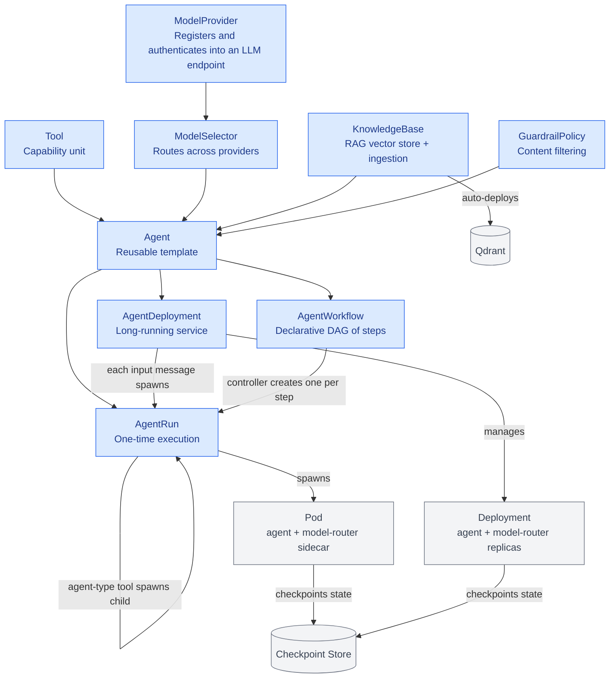

# Agent Orchestrator (agent-orc)

[](https://go.dev/)
[](https://github.com/floppyfish14/agent-orc/actions/workflows/test.yml)
[](https://github.com/floppyfish14/agent-orc/actions/workflows/lint.yml)
[](https://github.com/floppyfish14/agent-orc/actions/workflows/test-e2e.yml)
[](LICENSE)
[](https://github.com/floppyfish14/agent-orc/releases)

Agent Orchestrator is a Kubernetes-native platform for deploying, managing, and running AI agents at scale. It provides a declarative way to define agents, route them to appropriate LLM models, equip them with tools, and execute them either as one-time jobs or as long-running services.

> **Open source, Apache 2.0.** See [CONTRIBUTING.md](CONTRIBUTING.md) to get started,
> [CODE_OF_CONDUCT.md](CODE_OF_CONDUCT.md) for the community standard, and
> [SECURITY.md](SECURITY.md) for how to report vulnerabilities.

## Documentation

| Doc | Audience | What it covers |
|---|---|---|
| [Development Guide](docs/development.md) | Developers | Project structure, build/test commands, critical rules |
| [Integrating with agent-orc](docs/integrating.md) | Developers / integrators | End-to-end integration guide (CLI, SDKs, ACP API, observability) |
| [ACP API](docs/acp-api.md) | Developers | Agent discovery, manifest introspection, self-service run execution |
| [aoctl CLI Reference](docs/aoctl-reference.md) | Developers | Complete `aoctl` command reference |
| [OpenAPI Spec](docs/openapi-spec.md) | Developers | External Task API + ACP API machine-readable contracts |
| [Admin API](docs/admin-api.md) | Operators | Tenant lifecycle management (create, list, rotate-secret, delete) |
| [Rate Limiting](docs/rate-limiting.md) | Operators | Per-tenant quotas, budget enforcement, HTTP 429/402 responses |
| [Observability](docs/observability.md) | Operators | Health probes, Prometheus metrics, audit logging |
| [Egress Sinks](docs/egress-sinks.md) | Operators | Kafka/PubSub/Redis result delivery, AgentDeployment input sources |
| [CRDs](docs/crds.md) | Operators | All CRD definitions and field references |
| [Authentication](docs/auth.md) | Operators | OAuth2, OIDC, ServiceAccount, trust model |
| [Enterprise Integration](docs/enterprise-integration.md) | Enterprise | End-to-end enterprise setup (tenants, webhooks, guardrails, KBs) |
| [RAG / KnowledgeBase](docs/rag.md) | Developers | Vector store integration and built-in tools |
| [Redis Setup](docs/redis.md) | Operators | Redis configuration |
| [MCP Access Control](docs/mcp-access-control.md) | Operators | MCP server security |
| [AgentWorkflow](docs/agentworkflow.md) | Developers | Declarative DAG orchestration |

## Architecture

### Component Relationships



See [docs/crds.md](docs/crds.md) for detailed CRD documentation.

## Core Concepts

### Custom Resource Definitions (CRDs)

**Agent** - Defines a reusable agent template
- References a ModelSelector for LLM routing
- Lists available Tools
- Specifies runtime (OCI image + framework)
- Optional system prompt and memory config

**AgentRun** - One-time execution of an Agent
- Single input task with output
- Terminal lifecycle (Pending → Running → Succeeded/Failed)
- Tracks checkpoints for conversation state
- Supports restart policies and callbacks

**AgentDeployment** - Continuous, long-running agent service
- Manages pod replicas
- Auto-restarts on failure with exponential backoff
- Tracks consecutive failures and pauses if threshold exceeded
- Supports multiple input sources (chat API, queues, pubsub, self-managed loop)
- Persists conversation state via checkpoints

**ModelProvider** - Registers an LLM endpoint
- LiteLLM model string (OpenAI, Anthropic, Ollama, Bedrock, etc.)
- Credentials reference (K8s Secret)
- Capabilities (fast, cheap, reasoning, etc.)
- Constraints (context window, cost per million tokens, latency)

**ModelSelector** - Routes LLM calls to providers
- Routing strategy (rule-based, llm-meta, hybrid)
- Weighted provider selection
- Capability-based routing (e.g., "code" → GPT-4o, "reasoning" → Claude)
- Budget caps and fallback chains

**Tool** - Capability available to agents
- Type: regular (OCI), agent (orchestrator), mcp (Model Context Protocol), wasm
- Execution mode: pod, sidecar, wasm
- JSON schema for input/output
- Network egress rules, resource limits, cloud identity

**KnowledgeBase** - Vector store-backed RAG (Retrieval-Augmented Generation)
- Auto-deploys a Qdrant instance per namespace
- Embedding + chunking pipeline for documents
- Built-in `_rag_search` and `_rag_ingest` tools injected into agents
- Supports ConfigMaps, URLs, and S3 as document sources

**GuardrailPolicy** - Content filtering rules for agent inputs/outputs
- Input filters: validate user messages before reaching the LLM
- Output filters: validate LLM responses before reaching the caller
- Filter types: regex (redact/pattern match), keyword-blocklist, topic-validation
- Actions: redact, block, warn

**MCPServer** - Model Context Protocol server integration
- Declares tools from external MCP servers
- Auto-creates child Tool resources for each declared tool
- Supports stdio (sidecar), http, and sse transports
- Built-in access control via `allowedAgents` list

**TenantConfig** - Enterprise authentication and authorization
- OAuth2 client credentials or federated OIDC (Auth0, Okta, etc.)
- Namespace-scoped resource access control
- Rate limiting and daily budget caps
- Used by the ACP API for external integrations

**AgentWorkflow** - Declarative DAG orchestration
- Steps with dependencies (CEL conditions)
- Budget caps across all steps
- Adaptive step proposals from agents
- Creates AgentRuns for each step

### Checkpoint-Based State Management

Conversation state is stored as compressed **Checkpoints**:
- Session ID + version number
- Full conversation history (user/assistant messages)
- Metadata (token usage, cost, timestamps)
- Stored in configurable backend (in-memory, S3, GCS, etc.)

On each execution:
1. Load checkpoint for session
2. Build agent prompt with conversation history
3. Execute agent
4. Save new checkpoint with updated conversation
5. Return response + checkpoint reference

This enables:
- ✅ Conversation continuity across pod restarts
- ✅ Cost tracking per session
- ✅ Offline-capable resume (load checkpoint, pick up where you left off)
- ✅ Multi-turn conversations

## API Endpoints

agent-orc exposes three HTTP surfaces. Pick the right one for your integration:

| Surface | Port | Purpose | Auth |
|---------|------|---------|------|
| **External Task API** | **8084** | Programmatic task submit/poll/stream/cancel | OAuth2 JWT / federated OIDC / K8s SA (`POST /oauth/token`) |
| **ACP API** | **8000** | ACP-compatible agent discovery + run execution | Same bearer token as 8084 |
| UI API (dev) | 8080 | Local chat proxy via the UIProxy (React SPA) | session token (cluster-internal) |

For production, expose 8084 (and optionally 8000) behind an Ingress/Gateway.
The UI API (8083) stays cluster-internal behind the UIProxy Backend-for-Frontend
(see [docs/auth.md](docs/auth.md) and [docs/ui-proxy.md](docs/ui-proxy.md)).

### Observability endpoints (all surfaces)

Every external server exposes standard probes plus Prometheus metrics:

```bash
curl http://localhost:8084/healthz
curl http://localhost:8084/readyz
curl http://localhost:8084/version
curl http://localhost:8084/metrics   # Prometheus format: requests_total, auth_failures_total, ...
```

### External Task API (recommended for integrations)

The External Task API ([docs/enterprise-integration.md](docs/enterprise-integration.md),
contract: `GET /openapi.json`) lets external systems submit tasks, poll/stream
results, answer clarification questions, and receive webhook callbacks — without
managing Kubernetes resources.

```bash
# 1. Obtain an access token (client_credentials grant)
TOKEN=$(curl -s -X POST http://localhost:8084/oauth/token \
  -d "grant_type=client_credentials&client_id=acme-client&client_secret=secret123" \
  | jq -r .access_token)

# 2. Submit a task
curl -s -X POST http://localhost:8084/v1/tasks \
  -H "Authorization: Bearer $TOKEN" -H 'Content-Type: application/json' \
  -d '{ "agent": "support-bot", "input": "How do I reset my password?" }'

# 3. Stream tokens + events (SSE)
curl -N http://localhost:8084/v1/tasks/task-support-bot-abc123/stream \
  -H "Authorization: Bearer $TOKEN"
```

A CLI and Python/Go SDKs are available — see [docs/integrating.md](docs/integrating.md)
(`aoctl`, `pip install agentorc`, or use the generated client from the OpenAPI spec).

### ACP API — Agent discovery & self-service run

The ACP API (port 8000) lets callers discover which agents are available to
their tenant, inspect each agent's input/output schema and tools, and launch
runs — all without writing YAML or touching `kubectl`.

```bash
# 1. Discover available agents
curl -s http://localhost:8000/agents \
  -H "Authorization: Bearer $TOKEN"

# 2. Inspect an agent's manifest (schema, tools, knowledge bases, guardrails)
curl -s http://localhost:8000/agents/support-bot \
  -H "Authorization: Bearer $TOKEN"

# 3. Launch a run with schema-validated input
curl -s -X POST http://localhost:8000/agents/support-bot/run \
  -H "Authorization: Bearer $TOKEN" -H 'Content-Type: application/json' \
  -d '{ "input": [{"role":"user","parts":[{"content_type":"text/plain","content":"How do I reset my password?"}]}] }'

# Or use the CLI:
aoctl agents list
aoctl agents describe support-bot
aoctl agents run support-bot --input "How do I reset my password?"
```

### Deployment Execution (Chat-style API, dev only)

The UI proxy on port 8080 exposes a chat-style execution endpoint for local
development and the React UI.

```bash
# Send input to deployment, get response
curl -X POST http://localhost:8080/api/deployments/{namespace}/{name}/execute \
  -H 'Content-Type: application/json' \
  -d '{
    "input": "user message",
    "sessionId": "optional-session-id"
  }'

# Response
{
  "executionId": "exec-12345",
  "sessionId": "user-42",
  "input": "user message",
  "output": "agent response",
  "checkpointRef": "memory://user-42/v5",
  "tokensUsed": 142,
  "costUSD": "0.0042"
}
```

### Get Deployment Status

```bash
curl http://localhost:8080/api/deployments/{namespace}/{name}

# Response
{
  "name": "support-bot",
  "phase": "Running",
  "readyReplicas": 2,
  "consecutiveFailures": 0,
  "inputSourceType": "chat"
}
```

### Stream Deployment Events (Server-Sent Events)

```bash
curl http://localhost:8080/api/deployments/{namespace}/{name}/stream
```

## Example: Long-Running Support Bot

```yaml
---
# 1. Register the LLM provider
apiVersion: agentorc.agentorc.io/v1alpha1
kind: ModelProvider
metadata:
  name: gpt4-provider
spec:
  litellmModel: "openai/gpt-4o"
  credentialsRef:
    name: openai-credentials
    key: api-key
  capabilities:
    - fast
    - reasoning
  constraints:
    contextWindow: 128000
    costPerMillionInputTokens: "3.00"
    costPerMillionOutputTokens: "15.00"

---
# 2. Create a router
apiVersion: agentorc.agentorc.io/v1alpha1
kind: ModelSelector
metadata:
  name: support-router
spec:
  strategy: rule-based
  providers:
    - name: gpt4-provider
      weight: 100

---
# 3. Define a support agent
apiVersion: agentorc.agentorc.io/v1alpha1
kind: Agent
metadata:
  name: support-agent
spec:
  modelSelectorRef: support-router
  tools:
    - lookup-order
    - refund-tool
  systemPrompt: |
    You are a helpful support agent for our e-commerce platform.
    Help customers with orders, refunds, and billing.
  runtime:
    ociRef: ghcr.io/mycompany/support-agent:latest
    framework: openai-compatible

---
# 4. Deploy as a long-running service
apiVersion: agentorc.agentorc.io/v1alpha1
kind: AgentDeployment
metadata:
  name: support-bot
spec:
  agentRef: support-agent
  inputSource:
    type: chat
  replicas: 2
  restartPolicy:
    minBackoffSeconds: 5
    maxBackoffSeconds: 300
    maxConsecutiveFailures: 5
```

Now users can chat with the agent:

```bash
# User message 1
curl -X POST http://localhost:8080/api/deployments/default/support-bot/execute \
  -H 'Content-Type: application/json' \
  -d '{
    "input": "Hi, I have a problem with my order",
    "sessionId": "customer-12345"
  }'

# Response
{
  "sessionId": "customer-12345",
  "output": "I'd be happy to help! What's your order number?",
  "checkpointRef": "memory://customer-12345/v1"
}

# User message 2 (same session, agent remembers context)
curl -X POST http://localhost:8080/api/deployments/default/support-bot/execute \
  -H 'Content-Type: application/json' \
  -d '{
    "input": "Order #ORD-789",
    "sessionId": "customer-12345"
  }'

# Response
{
  "sessionId": "customer-12345",
  "output": "Found your order. What's the issue you're experiencing?",
  "checkpointRef": "memory://customer-12345/v2"
}
```

The agent pod can crash and restart—checkpoints survive. When the pod comes back, it loads the checkpoint and picks up the conversation where it left off.

## Quick Start

Get from zero to a running AI agent in under five minutes using a local [kind](https://kind.sigs.k8s.io/) cluster.

### Prerequisites

- [kind](https://kind.sigs.k8s.io/docs/user/quick-start/#installation) and [kubectl](https://kubernetes.io/docs/tasks/tools/) installed
- [Skaffold](https://skaffold.dev/docs/install/) installed
- [Docker](https://docs.docker.com/get-docker/) running locally
- An OpenAI API key (or Anthropic, Google, etc. with [LiteLLM-compatible](https://docs.litellm.ai/docs/providers) provider)

### 1. Create a local cluster

```bash
kind create cluster --name agent-orc-dev
```

### 2. Start development

```bash
export OPENAI_API_KEY=sk-...your-key-here...
skaffold dev -p dev
```

The `dev` profile builds all images and deploys agent-orc with the model-providers chart via Helm. It automatically:
- Builds operator, model-router, and UI images
- Deploys the full stack to `agent-orc-system` namespace
- Port-forwards the UI to http://localhost:8080
- Deploys ModelProviders for OpenAI, Anthropic, Google, and local Ollama (if available)

Leave this terminal running — it watches for file changes and rebuilds automatically. First run takes about two minutes.

### 3. Test agent execution

Use the test script to quickly create and run an agent:

```bash
./hack/test-agents.sh run --watch
```

This creates a test agent that routes through the default ModelSelector and answers a question. The `--watch` flag monitors status until completion.

### 4. Run the SOC Triage demo (optional)

```bash
skaffold run -p demo-soc-triage
```

This deploys a pre-built security operations demo that showcases:
- Multi-agent workflows with tool usage
- RAG-based knowledge retrieval
- Long-running deployments with chat input

### 5. Clean up

```bash
kind delete cluster
```

## Testing & Development

### Quick Agent Testing

The `hack/test-agents.sh` script auto-generates agents with unique names, eliminating the need to manually create manifests for each test:

```bash
# Test an AgentRun (one-time execution)
./hack/test-agents.sh run --watch

# Test an AgentDeployment (long-running service)
./hack/test-agents.sh deploy --watch

# Just create an Agent (for manual testing)
./hack/test-agents.sh agent

# List all test resources
./hack/test-agents.sh list

# Clean up test resources
./hack/test-agents.sh cleanup

# Target a specific namespace
./hack/test-agents.sh run -n custom-ns --watch
```

The script generates unique agent names using timestamps (e.g., `test-agent-1234567`) and creates a fully functional agent that:
- Calls the model-router at `localhost:8080` with the input
- Gets LLM response via configured ModelSelector routing
- Returns the LLM output as the agent result
- Uses Python 3.12 slim image with urllib for HTTP requests
- Includes error handling and 5-second timeouts
- Configurable resource requests/limits

Use `--watch` to monitor resource status until completion (or Ctrl-C to stop).

**Example output:**
```bash
$ ./hack/test-agents.sh run
▶ Creating Agent 'test-agent-089000'
✓ Agent created: test-agent-089000
▶ Creating AgentRun 'test-run-089000'
✓ AgentRun created: test-run-089000
```

The agent processes the input through the model-router and returns an LLM-generated response routed by the default ModelSelector.

## Development

### Deploying Locally

[Skaffold](https://skaffold.dev/) is the standard way to run agent-orc locally. It builds all images, deploys via Helm, watches for file changes, and automatically rebuilds and redeploys only the affected component.

#### Setup

```bash
kind create cluster --name agent-orc-dev
```

#### Usage

```bash
# Start continuous development — build, deploy, watch for changes, port-forward UI to :8080
skaffold dev

# One-off build + deploy without file watching
skaffold run

# Build images only (no deploy)
skaffold build

# Tear down everything Skaffold deployed
skaffold delete
```

`skaffold dev` deploys into the `agent-orc-system` namespace and port-forwards the UI to http://localhost:8080. When you edit source files it automatically rebuilds the affected image and redeploys. The `dev` Skaffold profile activates automatically when the current context is `kind-agent-orc-dev`.

### Building & Code Generation

```bash
# Build the operator
make build

# Run tests (full suite, includes controller envtest)
make test

# runtime decision logging (§4) metrics: operator exposes Prometheus on its metrics port; the
# model-router sidecar exposes trace-event client counters on :9091/metrics (pod port name
# `metrics`).

# UI trace (§5): SSE events are validated client-side; bad JSON or invalid `type` surfaces
# in the run trace as `agent_event` rows (`sse_*`). See ui/src/api/traceStream.ts.

# UI unit tests (Vitest): make test-ui   (or: cd ui && npm test)
# UI TypeScript: cd ui && npm run typecheck

# Generate CRD manifests
make manifests

# Generate code containing DeepCopy, DeepCopyInto, and DeepCopyObject method implementations.
make generate
```

## Contributing

Contributions are welcome! Please read [CONTRIBUTING.md](CONTRIBUTING.md) for the
development workflow, toolchain requirements, and the all-important code-generation
step (`make manifests && make generate`) that keeps the committed CRDs in sync.

By participating you agree to abide by the [Code of Conduct](CODE_OF_CONDUCT.md).

- **Found a bug or have a question?** Open a [GitHub issue](https://github.com/floppyfish14/agent-orc/issues/new/choose).
  For security vulnerabilities, see [SECURITY.md](SECURITY.md) — do **not** file a public issue.
- **Want to help but don't know where to start?** Look for issues labeled
  [`good first issue`](https://github.com/floppyfish14/agent-orc/issues?q=is%3Aopen+is%3Aissue+label%3A%22good+first+issue%22).
- **Toolchain:** Go 1.25+, Node 20+, kind, kubectl, helm, skaffold. The `Makefile`
  auto-downloads `controller-gen`, `kustomize`, and `golangci-lint` into `./bin/`
  on first use — no manual tool install required. See
  [Development Guide](docs/development.md) for the local Skaffold loop.
