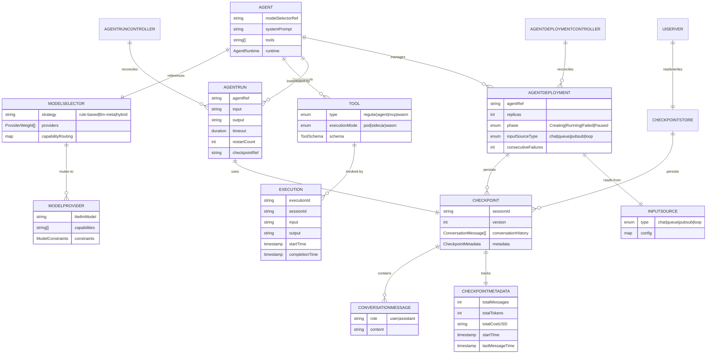

# Agent Orchestrator (agent-orc)

Agent Orchestrator is a Kubernetes-native platform for deploying, managing, and running AI agents at scale. It provides a declarative way to define agents, route them to appropriate LLM models, equip them with tools, and execute them either as one-time jobs or as long-running services.

## Architecture

### Component Relationships



## Core Concepts

### Custom Resource Definitions (CRDs)

**Agent** - Defines a reusable agent template
- References a ModelSelector for LLM routing
- Lists available Tools
- Specifies runtime (OCI image + framework)
- Optional system prompt and memory config

**AgentRun** - One-time execution of an Agent
- Single input task with output
- Terminal lifecycle (Pending → Running → Succeeded/Failed)
- Tracks checkpoints for conversation state
- Supports restart policies and callbacks

**AgentDeployment** - Continuous, long-running agent service
- Manages pod replicas
- Auto-restarts on failure with exponential backoff
- Tracks consecutive failures and pauses if threshold exceeded
- Supports multiple input sources (chat API, queues, pubsub, self-managed loop)
- Persists conversation state via checkpoints

**ModelProvider** - Registers an LLM endpoint
- LiteLLM model string (OpenAI, Anthropic, Ollama, Bedrock, etc.)
- Credentials reference (K8s Secret)
- Capabilities (fast, cheap, reasoning, etc.)
- Constraints (context window, cost per million tokens, latency)

**ModelSelector** - Routes LLM calls to providers
- Routing strategy (rule-based, llm-meta, hybrid)
- Weighted provider selection
- Capability-based routing (e.g., "code" → GPT-4o, "reasoning" → Claude)
- Budget caps and fallback chains

**Tool** - Capability available to agents
- Type: regular (OCI), agent (orchestrator), mcp (Model Context Protocol), wasm
- Execution mode: pod, sidecar, wasm
- JSON schema for input/output
- Network egress rules, resource limits, cloud identity

### Checkpoint-Based State Management

Conversation state is stored as compressed **Checkpoints**:
- Session ID + version number
- Full conversation history (user/assistant messages)
- Metadata (token usage, cost, timestamps)
- Stored in configurable backend (in-memory, S3, GCS, etc.)

On each execution:
1. Load checkpoint for session
2. Build agent prompt with conversation history
3. Execute agent
4. Save new checkpoint with updated conversation
5. Return response + checkpoint reference

This enables:
- ✅ Conversation continuity across pod restarts
- ✅ Cost tracking per session
- ✅ Offline-capable resume (load checkpoint, pick up where you left off)
- ✅ Multi-turn conversations

## API Endpoints

### Deployment Execution (Chat-style API)

```bash
# Send input to deployment, get response
POST /api/deployments/{namespace}/{name}/execute
{
  "input": "user message",
  "sessionId": "optional-session-id"
}

# Response
{
  "executionId": "exec-12345",
  "sessionId": "user-42",
  "input": "user message",
  "output": "agent response",
  "checkpointRef": "memory://user-42/v5",
  "tokensUsed": 142,
  "costUSD": "0.0042"
}
```

### Get Deployment Status

```bash
GET /api/deployments/{namespace}/{name}

# Response
{
  "name": "support-bot",
  "phase": "Running",
  "readyReplicas": 2,
  "consecutiveFailures": 0,
  "inputSourceType": "chat"
}
```

### Stream Deployment Events (Server-Sent Events)

```bash
GET /api/deployments/{namespace}/{name}/stream
```

## Example: Long-Running Support Bot

```yaml
---
# 1. Register the LLM provider
apiVersion: agentorc.agentorc.io/v1alpha1
kind: ModelProvider
metadata:
  name: gpt4-provider
spec:
  litellmModel: "openai/gpt-4o"
  credentialsRef:
    name: openai-credentials
    key: api-key
  capabilities:
    - fast
    - reasoning
  constraints:
    contextWindow: 128000
    costPerMillionInputTokens: "3.00"
    costPerMillionOutputTokens: "15.00"

---
# 2. Create a router
apiVersion: agentorc.agentorc.io/v1alpha1
kind: ModelSelector
metadata:
  name: support-router
spec:
  strategy: rule-based
  providers:
    - name: gpt4-provider
      weight: 100

---
# 3. Define a support agent
apiVersion: agentorc.agentorc.io/v1alpha1
kind: Agent
metadata:
  name: support-agent
spec:
  modelSelectorRef: support-router
  tools:
    - lookup-order
    - refund-tool
  systemPrompt: |
    You are a helpful support agent for our e-commerce platform.
    Help customers with orders, refunds, and billing.
  runtime:
    ociRef: ghcr.io/mycompany/support-agent:latest
    framework: openai-compatible

---
# 4. Deploy as a long-running service
apiVersion: agentorc.agentorc.io/v1alpha1
kind: AgentDeployment
metadata:
  name: support-bot
spec:
  agentRef: support-agent
  inputSource:
    type: chat
  replicas: 2
  restartPolicy:
    minBackoffSeconds: 5
    maxBackoffSeconds: 300
    maxConsecutiveFailures: 5
```

Now users can chat with the agent:

```bash
# User message 1
curl -X POST http://localhost:8083/api/deployments/default/support-bot/execute \
  -d '{
    "input": "Hi, I have a problem with my order",
    "sessionId": "customer-12345"
  }'

# Response
{
  "sessionId": "customer-12345",
  "output": "I'd be happy to help! What's your order number?",
  "checkpointRef": "memory://customer-12345/v1"
}

# User message 2 (same session, agent remembers context)
curl -X POST http://localhost:8083/api/deployments/default/support-bot/execute \
  -d '{
    "input": "Order #ORD-789",
    "sessionId": "customer-12345"
  }'

# Response
{
  "sessionId": "customer-12345",
  "output": "Found your order. What's the issue you're experiencing?",
  "checkpointRef": "memory://customer-12345/v2"
}
```

The agent pod can crash and restart—checkpoints survive. When the pod comes back, it loads the checkpoint and picks up the conversation where it left off.

## Quick Start

Get from zero to a running AI agent in under five minutes using a local [kind](https://kind.sigs.k8s.io/) cluster and an OpenAI API key.

### Prerequisites

- [kind](https://kind.sigs.k8s.io/docs/user/quick-start/#installation) and [kubectl](https://kubernetes.io/docs/tasks/tools/) installed
- [Skaffold](https://skaffold.dev/docs/install/) installed
- [Docker](https://docs.docker.com/get-docker/) running locally
- An OpenAI API key (or swap in any [LiteLLM-compatible](https://docs.litellm.ai/docs/providers) provider)

### 1. Create a local cluster and deploy the operator

```bash
kind create cluster --name agent-orc-dev
skaffold dev
```

`skaffold dev` builds all images (operator, model-router, UI), deploys the full stack via Helm, and port-forwards the UI to http://localhost:8080. Run the remaining steps in a second terminal — leave this one running. It typically takes about two minutes on first run.

### 2. Store your API key

```bash
kubectl create secret generic openai-dev-key \
  --from-literal=api-key=sk-...your-key-here...
```

### 3. Apply the quickstart manifests

```bash
kubectl apply -f config/samples/openai-agents.yaml
```

This single file wires together the full stack in one shot:

| Resource | Name | What it does |
|---|---|---|
| `ModelProvider` | `openai-gpt-oss-120b` | Registers GPT-4.1 with cost & capability metadata |
| `ModelSelector` | `default` | Routes requests across registered providers by weight |
| `Agent` | `hello-agent` | Template: system prompt + runtime + model selector |
| `AgentRun` | `hello-run-4` | One-shot execution with a real engineering question |

### 4. Watch the agent run

```bash
kubectl get agentrun hello-run-4 -w
```

```
NAME          PHASE     AGE
hello-run-4   Pending   1s
hello-run-4   Running   3s
hello-run-4   Succeeded 18s
```

Behind the scenes the operator created a Pod with a `model-router` sidecar that handled credential injection, LLM routing, and conversation checkpointing — all transparent to the agent code.

### 5. Read the output

```bash
kubectl get agentrun hello-run-4 -o jsonpath='{.status.output}'
```

```
To reduce pod startup p99 from 8s to under 2s on GKE I'd evaluate three approaches:

1. **Pre-pulled image cache** — Use a DaemonSet to warm the image cache on every node...
```

### 6. Deploy a long-running chat agent (optional)

Run the agent as a persistent service that accepts chat messages over HTTP:

```bash
kubectl apply -f config/samples/agentdeployment-demo.yaml

# Wait for the deployment to be ready
kubectl get agentdeployment demo-chat-deployment -w
```

```
NAME                   PHASE     READY   AGE
demo-chat-deployment   Running   1/1     12s
```

Send a message and get a response (conversation state is checkpointed automatically):

```bash
# Turn 1
curl -s -X POST http://localhost:8083/api/deployments/default/demo-chat-deployment/execute \
  -H 'Content-Type: application/json' \
  -d '{"input": "What is the capital of France?", "sessionId": "user-1"}' | jq .

# Turn 2 — the agent remembers the previous exchange
curl -s -X POST http://localhost:8083/api/deployments/default/demo-chat-deployment/execute \
  -H 'Content-Type: application/json' \
  -d '{"input": "What is its population?", "sessionId": "user-1"}' | jq .
```

The agent pod can crash and restart — checkpoints survive. On restart it loads the checkpoint and picks up the conversation exactly where it left off.

### 7. Clean up

```bash
kind delete cluster
```

## Testing & Development

### Quick Agent Testing

The `hack/test-agents.sh` script auto-generates agents with unique names, eliminating the need to manually create manifests for each test:

```bash
# Test an AgentRun (one-time execution)
./hack/test-agents.sh run --watch

# Test an AgentDeployment (long-running service)
./hack/test-agents.sh deploy --watch

# Just create an Agent (for manual testing)
./hack/test-agents.sh agent

# List all test resources
./hack/test-agents.sh list

# Clean up test resources
./hack/test-agents.sh cleanup

# Target a specific namespace
./hack/test-agents.sh run -n custom-ns --watch
```

The script generates unique agent names using timestamps (e.g., `test-agent-1234567`) and creates a fully functional agent that:
- Calls the model-router at `localhost:8080` with the input
- Gets LLM response via configured ModelSelector routing
- Returns the LLM output as the agent result
- Uses Python 3.12 slim image with urllib for HTTP requests
- Includes error handling and 5-second timeouts
- Configurable resource requests/limits

Use `--watch` to monitor resource status until completion (or Ctrl-C to stop).

**Example output:**
```bash
$ ./hack/test-agents.sh run
▶ Creating Agent 'test-agent-089000'
✓ Agent created: test-agent-089000
▶ Creating AgentRun 'test-run-089000'
✓ AgentRun created: test-run-089000
```

The agent processes the input through the model-router and returns an LLM-generated response routed by the default ModelSelector.

## Development

### Deploying Locally

[Skaffold](https://skaffold.dev/) is the standard way to run agent-orc locally. It builds all images, deploys via Helm, watches for file changes, and automatically rebuilds and redeploys only the affected component.

#### Setup

```bash
kind create cluster --name agent-orc-dev
```

#### Usage

```bash
# Start continuous development — build, deploy, watch for changes, port-forward UI to :8080
skaffold dev

# One-off build + deploy without file watching
skaffold run

# Build images only (no deploy)
skaffold build

# Tear down everything Skaffold deployed
skaffold delete
```

`skaffold dev` deploys into the `agent-orc-system` namespace and port-forwards the UI to http://localhost:8080. When you edit source files it automatically rebuilds the affected image and redeploys. The `dev` Skaffold profile activates automatically when the current context is `kind-agent-orc-dev`.

### Building & Code Generation

```bash
# Build the operator
make build

# Run tests (full suite, includes controller envtest)
make test

# runtime decision logging (§4) metrics: operator exposes Prometheus on its metrics port; the
# model-router sidecar exposes trace-event client counters on :9091/metrics (pod port name
# `metrics`).

# UI trace (§5): SSE events are validated client-side; bad JSON or invalid `type` surfaces
# in the run trace as `agent_event` rows (`sse_*`). See ui/src/api/traceStream.ts.

# UI unit tests (Vitest): make test-ui   (or: cd ui && npm test)
# UI TypeScript: cd ui && npm run typecheck

# Generate CRD manifests
make manifests

# Generate code
make generate
```
