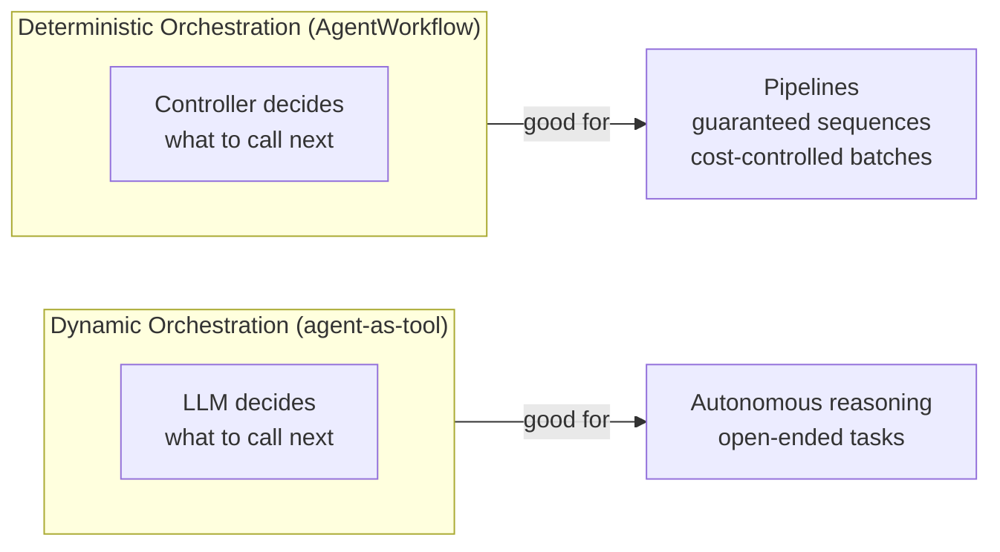
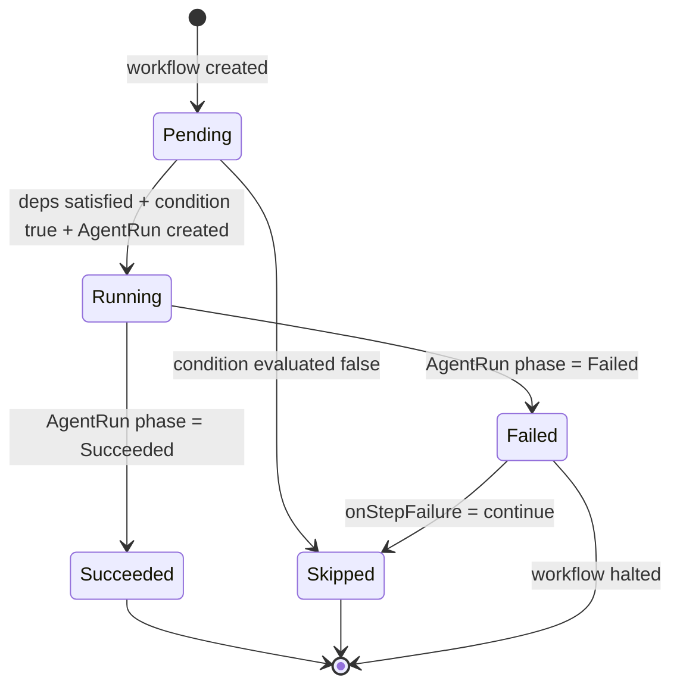
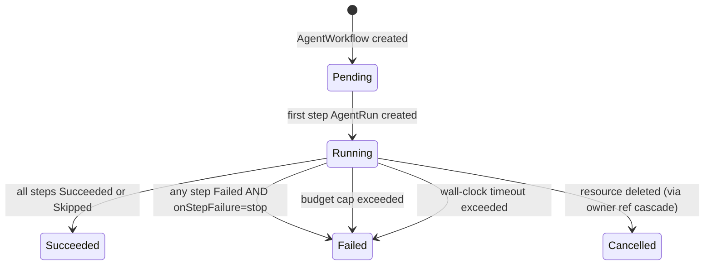

# AgentWorkflow

## What it is

`AgentWorkflow` is a declarative DAG (directed acyclic graph) of agent steps. The operator controller sequences steps, threads outputs between them, and enforces budget caps — without requiring the LLM to coordinate execution.

It is the **deterministic** complement to the **dynamic** agent-as-tool pattern:



| | Agent-as-tool | AgentWorkflow |
|---|---|---|
| Who decides sequencing? | The LLM at runtime | You, declaratively |
| Deterministic? | No | Yes — controller enforced |
| Observable in K8s API? | Label scan only | Full phase/step status |
| Atomic cancellation? | Delete each run manually | `kubectl delete agentworkflow` cascades |
| Budget scope? | Per-run only | Across entire workflow |
| Context threading? | You prompt the LLM | Controller wires output → input |

---

## Schema reference

```yaml
apiVersion: agentorc.agentorc.io/v1alpha1
kind: AgentWorkflow
metadata:
  name: my-workflow
spec:
  # steps defines the DAG. Steps with no dependsOn start immediately.
  steps:
    - name: string                    # unique within this workflow, lowercase alphanumeric + hyphens
      agentRef: string                # name of the Agent CRD to run
      input: string                   # task string; supports {{steps.<name>.output}}
      dependsOn: []string             # step names that must complete first
      condition: string               # CEL expression; step is Skipped if false
      timeout: duration               # overrides workflow timeout for this step
      callbacks:
        onComplete: string            # URL POSTed on step success
        onFailed: string              # URL POSTed on step failure

  # budgetCap limits total USD across all steps combined.
  budgetCap:
    total: "2.00"

  # timeout is the wall-clock limit for the entire workflow.
  timeout: 30m

  # onStepFailure: "stop" (default) or "continue"
  # stop:     mark workflow Failed, do not start new steps
  # continue: mark failed step Skipped, continue with dependents
  onStepFailure: stop
```

### Template variables

Within a step's `input` field you can reference outputs from predecessor steps:

| Variable | Resolves to |
|---|---|
| `{{steps.<name>.output}}` | The `Output` field of the named step's AgentRun (truncated to 10 KB) |

Example:
```yaml
- name: summarize
  agentRef: writer-agent
  dependsOn: [analyze]
  input: "Write an executive summary of this analysis: {{steps.analyze.output}}"
```

### CEL conditions

The `condition` field accepts a subset of CEL expressions. The `steps` variable is a map of step name → `{phase, output}`.

Supported form: `steps["<name>"].phase == "<phase>"` or `steps["<name>"].output == "<value>"`

```yaml
condition: 'steps["gather"].phase == "Succeeded"'
```

If the expression evaluates to `false`, the step is marked `Skipped` rather than started. Full CEL library support can be wired in without changing call sites.

---

## Step phase lifecycle



---

## Workflow phase lifecycle



---

## What the controller creates

For each step, the controller creates one `AgentRun` with:
- Name: `<workflow-name>-<step-name>` (deterministic, idempotent on re-reconcile)
- Owner reference to the `AgentWorkflow` (so `kubectl delete agentworkflow` cascades)
- Labels:
  ```
  agentorc.io/workflow: <workflow-name>
  agentorc.io/workflow-step: <step-name>
  ```

The controller polls step AgentRuns every 10 seconds (no watch — polling keeps the controller simple).

---

## Examples

### Linear chain: research → analyze → summarize

```yaml
apiVersion: agentorc.agentorc.io/v1alpha1
kind: AgentWorkflow
metadata:
  name: research-pipeline
spec:
  budgetCap:
    total: "1.50"
  timeout: 20m
  steps:
    - name: research
      agentRef: researcher-agent
      input: "Research the latest developments in quantum computing in 2026."

    - name: analyze
      agentRef: analyst-agent
      dependsOn: [research]
      input: |
        Analyze the following research findings and identify the top 3 implications
        for enterprise software companies:

        {{steps.research.output}}

    - name: summarize
      agentRef: writer-agent
      dependsOn: [analyze]
      input: |
        Write a 200-word executive summary based on this analysis:

        {{steps.analyze.output}}
```

### Fan-out with conditional merge

```yaml
apiVersion: agentorc.agentorc.io/v1alpha1
kind: AgentWorkflow
metadata:
  name: parallel-review
spec:
  onStepFailure: continue
  steps:
    - name: gather
      agentRef: data-agent
      input: "Gather Q1 2026 sales data for regions EMEA and APAC."

    - name: emea-analysis
      agentRef: analyst-agent
      dependsOn: [gather]
      input: "Analyze EMEA region from: {{steps.gather.output}}"

    - name: apac-analysis
      agentRef: analyst-agent
      dependsOn: [gather]
      input: "Analyze APAC region from: {{steps.gather.output}}"

    - name: merge
      agentRef: writer-agent
      dependsOn: [emea-analysis, apac-analysis]
      condition: 'steps["emea-analysis"].phase == "Succeeded"'
      input: |
        Combine these regional analyses into a unified report:

        EMEA: {{steps.emea-analysis.output}}
        APAC: {{steps.apac-analysis.output}}
```

### Error handling with `onStepFailure: continue`

```yaml
spec:
  onStepFailure: continue   # failed steps become Skipped; subsequent steps may still run
  steps:
    - name: optional-enrichment
      agentRef: enrichment-agent
      input: "Enrich the dataset with external signals."

    - name: report
      agentRef: reporter-agent
      dependsOn: [optional-enrichment]
      # runs even if optional-enrichment failed/was skipped
      input: "Generate the report. Enrichment data (if available): {{steps.optional-enrichment.output}}"
```

---

## Observing workflow progress

```bash
# Watch overall phase
kubectl get agentworkflow my-workflow -w

# Inspect step-level status
kubectl get agentworkflow my-workflow -o jsonpath='{.status.steps}' | jq .

# Follow a step's AgentRun directly
kubectl get agentrun my-workflow-research -o wide

# Total spend so far
kubectl get agentworkflow my-workflow -o jsonpath='{.status.totalSpendUSD}'
```

Example `kubectl get agentworkflow` output:
```
NAME                PHASE       SPEND        AGE
research-pipeline   Running     0.000321     42s
```

---

## Budget enforcement

`spec.budgetCap.total` is checked after each step completes. When the cumulative spend across all steps exceeds the cap:
1. The workflow transitions to `Failed`.
2. No new steps are started.
3. `status.totalSpendUSD` records the final spend.

Individual step budgets are controlled via the referenced `Agent` → `ModelSelector.budgetCap.perRun`.

---

## Interaction with agent-as-tool

AgentWorkflow and agent-as-tool compose cleanly. A workflow step runs an `AgentRun` which may itself use agent-type tools (spawning child AgentRuns dynamically). The workflow controller only tracks the top-level step AgentRun — nested agent-tool calls are invisible to it and handled entirely by the dynamic pattern.

```
AgentWorkflow
  └── step "analyze" → AgentRun (analyst-agent)
        └── [LLM decides] tool call → child AgentRun (research-subagent)
        └── [LLM decides] tool call → child AgentRun (database-agent)
      step output → step "summarize" → AgentRun (writer-agent)
```

The workflow provides the outer deterministic skeleton; the agent-as-tool pattern handles inner dynamic reasoning.
