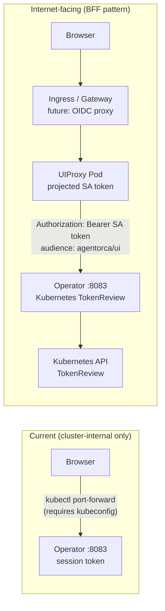
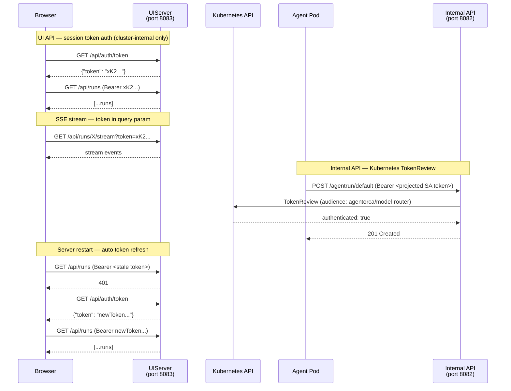
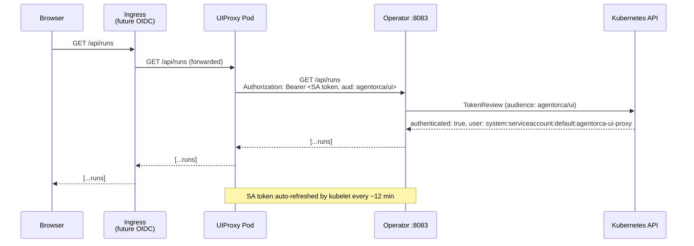

# Authentication

agent-orca exposes two distinct HTTP API surfaces with different authentication models:

| Surface | Port | Caller | Auth mechanism |
|---------|------|--------|----------------|
| Internal Agent API | 8082 | Agent pods, model-routers | Kubernetes TokenReview (projected SA token, audience `agentorca/model-router`) |
| UI API | 8083 | UIProxy pod | Kubernetes TokenReview (projected SA token, audience `agentorca/ui`) |

MCP servers have their own access-control and identity layer, documented separately in [mcp-access-control.md](mcp-access-control.md).

The **browser never talks to the operator directly**. It connects to the UIProxy pod, which
holds the SA token and injects it on every proxied request. See [ui-proxy.md](ui-proxy.md)
for deployment details.

---

## Internal Agent API (port 8082)

Every agent pod and model-router sidecar communicates with the operator over this API to create child AgentRuns and report status. Callers must present a Kubernetes ServiceAccount token in the `Authorization: Bearer` header.

### How the token gets into the pod

The controller injects a [projected ServiceAccount token volume](https://kubernetes.io/docs/tasks/configure-pod-container/configure-service-account/#launch-a-pod-using-service-account-token-projection) into every agent pod at creation time:

```yaml
volumes:
  - name: kube-api-access
    projected:
      sources:
        - serviceAccountToken:
            audience: agentorca/model-router
            expirationSeconds: 900        # 15-minute token, auto-refreshed by kubelet
            path: token
```

The audience is scoped to `agentorca/model-router` so the token cannot be replayed against the Kubernetes API server itself.

### How the operator validates the token

On every request `apiserver.go` calls the Kubernetes **TokenReview API**:

```
POST /apis/authentication.k8s.io/v1/tokenreviews
{
  "spec": {
    "token": "<bearer token from request>",
    "audiences": ["agentorca/model-router"]
  }
}
```

The Kubernetes API server verifies the token's signature, expiry, audience, and that the bound ServiceAccount still exists. A `401` is returned if any check fails.

---

## UI API (port 8083)

The React UI is served to a browser — browsers have no access to Kubernetes ServiceAccount tokens. Instead the operator generates a random **session token** at startup and makes it available to the frontend automatically.

### Token lifecycle

1. At startup, the operator generates a cryptographically random 32-byte token encoded as URL-safe base64 (`crypto/rand`). This token lives only in memory and changes on every restart.
2. The token is served at `GET /api/auth/token` with no authentication required.
3. Every other endpoint on port 8083 requires `Authorization: Bearer <token>` (or `?token=<token>` for SSE streams — see below).
4. Validation uses `crypto/subtle.ConstantTimeCompare` to prevent timing-based token inference attacks.

### Security model and trust boundary

The `/api/auth/token` endpoint is intentionally unauthenticated. The security boundary is **entirely network-level**:

- The UI service is a `ClusterIP` — only reachable from within the cluster.
- Operators access the UI via `kubectl port-forward`, which tunnels through the Kubernetes API server and therefore implicitly requires a valid kubeconfig with sufficient RBAC.
- A `NetworkPolicy` should restrict which pods can reach port 8083 to narrow the blast radius further.

**The session token is NOT sufficient for internet exposure.** If port 8083 is reachable from the internet (e.g. via a `LoadBalancer` service, Ingress, or Kubernetes Gateway API), any unauthenticated internet user can call `GET /api/auth/token`, receive the session token, and make arbitrary API calls. See [Internet-facing deployment](#internet-facing-deployment) below.

### Browser flow

```
Browser                         UIServer (operator pod)
  |                                     |
  |── GET /api/auth/token ──────────────>|
  |<── {"token": "<random>"} ───────────|  (no auth required)
  |                                     |
  |  [store token in sessionStorage]    |
  |                                     |
  |── GET /api/runs                     |
  |   Authorization: Bearer <token> ───>|
  |<── [...runs] ───────────────────────|
  |                                     |
  |── EventSource /api/runs/X/stream    |
  |   ?token=<token> ────────────────── >|  (EventSource cannot set headers)
  |<── data: {...} ─────────────────────|
  |                                     |
  |  [server restarts, new token]       |
  |                                     |
  |── GET /api/runs                     |
  |   Authorization: Bearer <old-token> >|
  |<── 401 ─────────────────────────────|
  |                                     |
  |── GET /api/auth/token ──────────────>|  (auto-retry on 401)
  |<── {"token": "<new-random>"} ───────|
  |                                     |
  |── GET /api/runs                     |
  |   Authorization: Bearer <new-token> >|
  |<── [...runs] ───────────────────────|
```

The `initAuth()` function in `ui/src/api/sse.ts` is called on page load and wired to the global 401 handler, so token refresh after a server restart is transparent to the user.

### SSE stream authentication

The `EventSource` browser API does not support custom headers. SSE streams pass the token as a query parameter instead:

```
GET /api/runs/{name}/stream?namespace=default&token=<session-token>
```

The `requireAuth` middleware checks `Authorization: Bearer` first, then falls back to `?token=`.

### Disabling auth

Auth can be disabled for local development:

```
--ui-auth-enabled=false
```

When disabled, `GET /api/auth/token` returns `{"token": ""}` and no `Authorization` header is required.

---

## Internet-facing deployment

### Why the current model breaks

When port 8083 is reachable from the internet (LoadBalancer, Ingress, Gateway API), the session token provides no real security:

1. Internet user → `GET /api/auth/token` → receives session token (no auth required)
2. Internet user → `GET /api/runs` with token → full API access

The `kubectl port-forward` path inherently gatekeeps on Kubernetes RBAC. A LoadBalancer bypasses this entirely — the session token becomes trivially obtainable by anyone who discovers the address.

### Required architecture: Backend-for-Frontend (BFF)

To ensure every request reaching the operator API comes from a valid Kubernetes pod — and to support OIDC/SAML/token auth in front of the UI later — the correct pattern is a **Backend-for-Frontend proxy**:

```
Internet
  │
  ▼
Ingress / Gateway API
  │  (future: OAuth2 Proxy / OIDC / SAML here)
  ▼
UIProxy Pod  ──── projected SA token (audience: agentorca/ui) ────▶  Operator (port 8083)
  │                                                                   │
  │  serves React SPA                                                 │  TokenReview validates
  │  proxies /api/* to operator                                       │  SA is a valid cluster pod
  ▼
Browser
```

In this model:
- The browser never talks directly to the operator. It only talks to the UIProxy pod.
- The UIProxy holds a projected SA token with audience `agentorca/ui`, mounted by the kubelet and auto-refreshed every 15 minutes.
- The operator validates every inbound request via Kubernetes TokenReview — the same mechanism used for agent pods on port 8082.
- Adding OIDC/SAML later is a configuration change to the Ingress/Gateway, not a code change to agent-orca.

### Flow comparison



### What needs to change for the BFF pattern

**Operator (`uiapi.go`):** Replace the session-token `requireAuth` middleware with Kubernetes TokenReview scoped to a `agentorca/ui` audience — the same approach used on port 8082 for `agentorca/model-router`. The `validateUIToken` implementation was prototyped during earlier work and just needs to be restored.

**UIProxy:** A small deployment (Nginx, Caddy, or a thin Go reverse proxy) that:
1. Serves the pre-built React static assets.
2. Proxies `/api/*` to the operator's ClusterIP, adding `Authorization: Bearer $(cat /var/run/secrets/agentorca/ui/token)` from its projected volume.
3. Has its own ServiceAccount with a projected token: audience `agentorca/ui`, expiry 15 minutes.

**NetworkPolicy:** Restrict port 8083 on the operator to `podSelector` matching only the UIProxy's SA label. Deny all other in-cluster access.

**Ingress/Gateway:** Routes to the UIProxy service. No changes to the operator needed. OAuth2 Proxy or similar can be layered on the Ingress later.

---

## Full request flow (current)



## Full request flow (internet-facing BFF)



## See also
