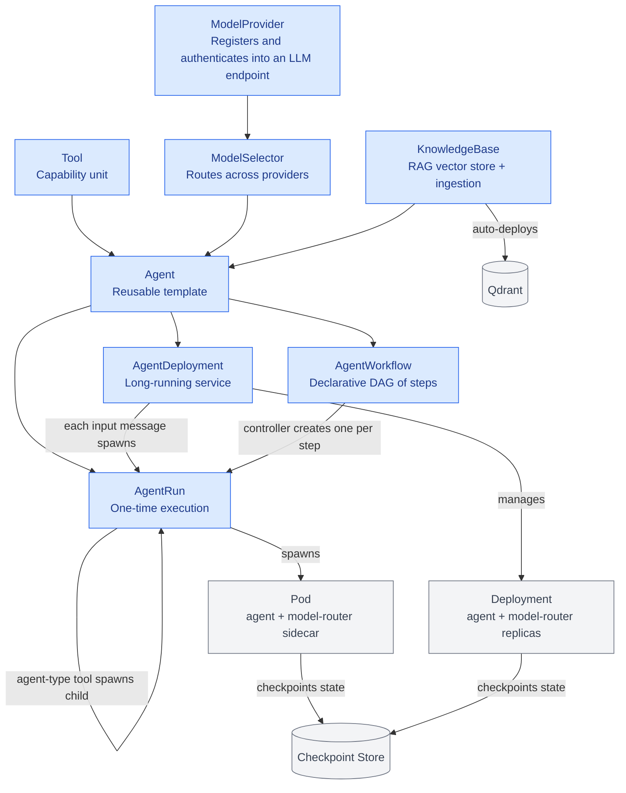
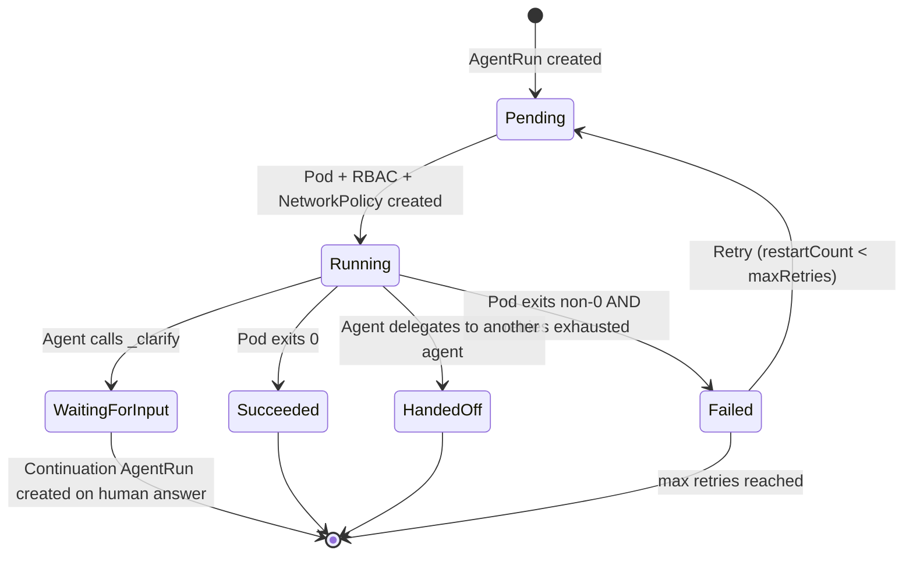
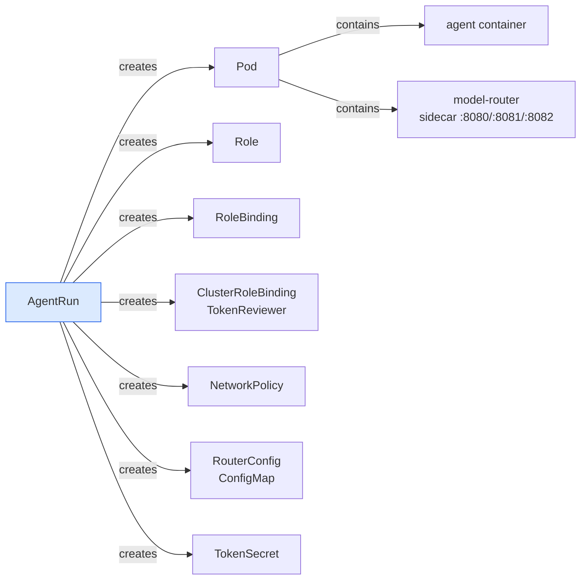
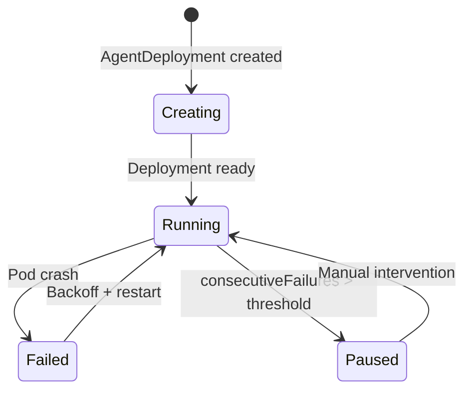
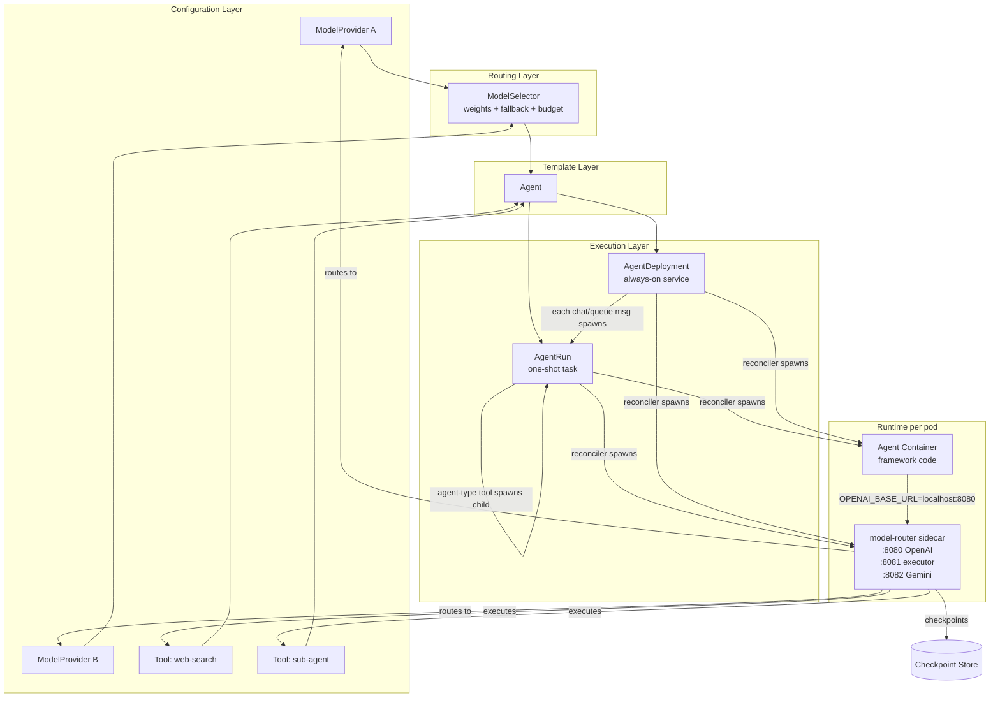
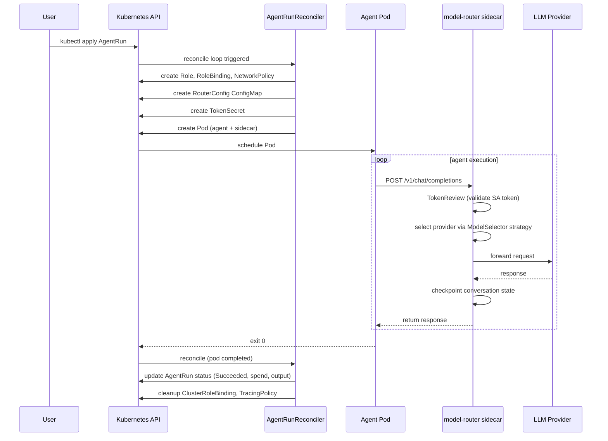

# agent-orc CRDs

agent-orc uses eight Custom Resource Definitions (CRDs) that form a layered model: from raw LLM endpoints at the bottom to long-running agent services at the top.

---

## CRD Overview



---

## 1. ModelProvider

**Purpose:** Registers a single LLM endpoint (e.g., a specific Claude or GPT-4 model) with its credentials, cost, and capabilities.

**Key fields:**

| Field | Description |
|---|---|
| `litellmModel` | LiteLLM model string, e.g. `anthropic/claude-sonnet-4-6` |
| `baseURL` | Optional API endpoint override for self-hosted models (e.g. `http://ollama.svc:11434`) |
| `credentialsRef` | SecretKeyRef pointing to the API key |
| `capabilities` | Tags: `reasoning`, `code`, `vision`, `fast`, `long-context`, `cheap`, `embedding` |
| `constraints` | Context window, max output tokens, cost per million tokens |
| `latencyProfile` | `fast`, `medium`, or `slow` |

**Status:** Sets a `ready` boolean and re-validates every 5 minutes.

```yaml
apiVersion: agentorc.agentorc.io/v1alpha1
kind: ModelProvider
metadata:
  name: claude-sonnet
spec:
  litellmModel: anthropic/claude-sonnet-4-6
  credentialsRef:
    name: anthropic-secret
    key: ANTHROPIC_API_KEY
  capabilities: [reasoning, code, vision]
  latencyProfile: medium
  constraints:
    costPerMillionInputTokens: "3.00"
    costPerMillionOutputTokens: "15.00"
```

---

## 2. ModelSelector

**Purpose:** Routes LLM calls across one or more ModelProviders using weights, fallback chains, capability routing, and optional LLM-based meta-routing.

**Key fields:**

| Field | Description |
|---|---|
| `strategy` | `rule-based` (default), `llm-meta`, or `hybrid` |
| `providers` | List of `{name, weight}` for probabilistic routing |
| `fallbackChain` | Ordered providers to try on 429/5xx errors |
| `budgetCap` | Max USD spend `perRun` and/or `perDay` |
| `capabilityRouting` | Map of capability tag → provider name |
| `metaRouter` | Config for the LLM that decides routing (llm-meta/hybrid) |

```yaml
apiVersion: agentorc.agentorc.io/v1alpha1
kind: ModelSelector
metadata:
  name: default
spec:
  strategy: rule-based
  providers:
    - name: claude-sonnet
      weight: 70
    - name: openai-gpt4o
      weight: 30
  fallbackChain: [openai-gpt4o, claude-sonnet]
  budgetCap:
    perRun: "0.50"
  capabilityRouting:
    reasoning: claude-sonnet
    fast: openai-gpt4o
```

---

## 3. Tool

**Purpose:** Defines a capability that an agent can invoke — a function, another agent, an MCP server, or a WASM module.

**Types:**

| Type | Description | Required |
|---|---|---|
| `regular` | OCI image run as a pod or sidecar | `ociRef` |
| `agent` | Another Agent exposed as a tool | `agentRef` |
| `mcp` | Model Context Protocol server | `mcpConfig` |
| `wasm` | WASM module run inside model-router | `ociRef` |

**Execution modes:**

| Mode | Isolation | Latency | State |
|---|---|---|---|
| `pod` | High — fresh pod per call | High | Stateless |
| `sidecar` | Medium — shares agent pod | Low | Stateful |
| `wasm` | Low — in-process | Very low | Stateless |

**Key fields:**

| Field | Description |
|---|---|
| `schema` | JSON Schema `description`, `input`, `output` shown to the LLM |
| `networkEgress` | Allowlisted outbound hosts/ports |
| `cloudAuth` | Tool-specific cloud identity (GCP/AWS/Azure) |

```yaml
apiVersion: agentorc.agentorc.io/v1alpha1
kind: Tool
metadata:
  name: web-search
spec:
  type: regular
  executionMode: sidecar
  ociRef: ghcr.io/myorg/web-search-tool:latest
  schema:
    description: Search the web for current information
    input:
      type: object
      properties:
        query: {type: string}
  networkEgress:
    - host: "*.googleapis.com"
      port: 443
```

---

## 4. Agent

**Purpose:** A reusable, versioned agent template. Binds together a runtime image, a model routing strategy, and a set of tools.

**Key fields:**

| Field | Description |
|---|---|
| `modelSelectorRef` | Which ModelSelector to use for LLM calls |
| `tools` | Names of Tool resources available to this agent |
| `systemPrompt` | System instruction prepended to every conversation |
| `runtime.ociRef` | OCI image (must be Cosign-signed) |
| `runtime.framework` | `openai-compatible`, `autogen`, `semantic-kernel`, `langgraph`, `shim` |
| `runtime.shimTarget` | Hostname to intercept when framework=`shim` |
| `memory.checkpointEvery` | LLM turns between checkpoints (default: 1) |
| `memory.resumeWindowSeconds` | State retention after failure (default: 3600) |
| `memory.archiveOnCompletion` | Promote checkpoint to object storage on success |
| `memory.episodicSummaryEvery` | Summarize conversation every N turns to compress context (0 disables) |
| `memory.summaryModelSelectorRef` | ModelSelector for summarization calls (defaults to agent's own) |
| `memory.longTermMemoryRef` | KnowledgeBase name for persistent cross-session memory |
| `knowledgeBases` | KnowledgeBase names; injects `_rag_search` / `_rag_ingest` tools |
| `guardrailPolicyRef` | GuardrailPolicy name for input/output content filtering |
| `cloudAuth` | Cloud identity for the agent's SA (GCP/AWS/Azure) |

**Framework tiers:**

| Tier | Framework | How the model endpoint is injected |
|---|---|---|
| 1 | `openai-compatible` | `OPENAI_BASE_URL=http://localhost:8080` |
| 2 | `autogen` / `semantic-kernel` | `OAI_CONFIG_LIST` via init container |
| 3 | `langgraph` | `LANGGRAPH_CHECKPOINT_URL` |
| Shim | `shim` | `/etc/hosts` interception of `shimTarget` |

**What the controller does:** Creates and manages a stable ServiceAccount (`agentorc-agent-<name>`) and annotates it for cloud identity federation.

```yaml
apiVersion: agentorc.agentorc.io/v1alpha1
kind: Agent
metadata:
  name: hello-agent
spec:
  modelSelectorRef: default
  tools: [web-search]
  systemPrompt: "You are a helpful assistant."
  runtime:
    ociRef: ghcr.io/myorg/my-agent:latest
    framework: openai-compatible
  memory:
    checkpointEvery: 5
    resumeWindowSeconds: 3600
    archiveOnCompletion: true
```

---

## 5. AgentRun

**Purpose:** A single, one-shot execution of an Agent. The primary way to run an agent for a specific task.

**Key fields:**

| Field | Description |
|---|---|
| `agentRef` | Name of the Agent to run |
| `input` | Task description passed via `AGENTORC_INPUT` |
| `timeout` | Max duration (default: 5 min) |
| `callbacks` | Webhook URLs for `onComplete` / `onFailed` |
| `restartPolicy.maxRetries` | Retry count on failure (default: 3) |
| `parentRunRef` | Parent AgentRun when this is spawned as a sub-agent tool |
| `priorRunRef` | Previous AgentRun in a chat session; loads its conversation checkpoint for continuation |
| `safeguards` | Loop detection limits (`maxConsecutiveNoopTurns`, `maxRepeatedToolCalls`) |
| `egress` | Result egress sink configuration (optional) |

**Egress configuration (optional):**

When `spec.egress` is set, the controller publishes the final `EgressResult` to the specified sink when the AgentRun reaches a terminal phase (`Succeeded`, `Failed`, or `HandedOff`). This is useful for streaming results to downstream systems (e.g., a chat backend, analytics pipeline, or event bus).

| Field | Description |
|---|---|
| `type` | `kafka`, `pubsub`, or `redis` |
| `topic` | Topic/stream name (Kafka topic, Pub/Sub topic, or Redis stream key) |
| `projectID` | GCP project ID (Pub/Sub only) |
| `brokers` | Kafka broker addresses (Kafka only) |
| `address` | Redis address (Redis only) |
| `secretRef` | SecretKeyRef pointing to sink credentials |

**Secret key conventions:**

| Sink | Secret keys |
|---|---|
| Kafka | `sasl-username`, `sasl-password`, `sasl-mechanism`, `tls-cert`, `tls-key`, `tls-ca` |
| Pub/Sub | `credentials` (service account JSON blob) |
| Redis | `password` |

```yaml
apiVersion: agentorc.agentorc.io/v1alpha1
kind: AgentRun
metadata:
  name: hello-run
spec:
  agentRef: hello-agent
  input: "Say hello to the world"
  egress:
    type: kafka
    topic: agent-results
    brokers:
      - kafka-cluster-kafka-bootstrap.kafka:9092
    secretRef:
      name: kafka-creds
      key: sasl-password
      namespace: default
```

**Metrics:**

| Metric | Description |
|---|---|
| `agentorc_egress_published_total` | Counter of successfully published results |
| `agentorc_egress_failed_total` | Counter of failed publishes |

**Phase lifecycle:**



**What the reconciler creates per run:**



**Status fields of note:**

| Field | Description |
|---|---|
| `phase` | Current lifecycle phase |
| `spendUSD` | Cumulative USD spend for this run |
| `output` | Agent output (truncated to 10 KB) |
| `routingDecisions` | History of model selection choices |
| `childRunRefs` | Sub-agent AgentRuns spawned via tools |
| `checkpointRef` | Storage key for conversation state |
| `clarifyQuestion` | Question posed to the human when phase is `WaitingForInput` |
| `clarifyAnswer` | Human's response submitted via the UI |
| `continuationRunRef` | Follow-up AgentRun created after the human answers |
| `loopDetected` | Set when a safeguard (loop detection) tripped and halted the run |
| `failureReason` | Human-readable reason the run failed |

---

## 6. AgentDeployment

**Purpose:** Keeps an agent running continuously, accepting a stream of inputs from a chat API, message queue, or pubsub topic.

**Key fields:**

| Field | Description |
|---|---|
| `agentRef` | Agent template to deploy |
| `replicas` | Pod replicas (default: 1) |
| `inputSource.type` | `chat` (default), `queue`, `pubsub`, or `loop` |
| `inputSource.config` | Provider-specific config (Redis, Kafka, etc.) |
| `restartPolicy.minBackoffSeconds` | Min restart delay (default: 5s) |
| `restartPolicy.maxBackoffSeconds` | Max restart delay (default: 300s) |
| `restartPolicy.maxConsecutiveFailures` | Pause threshold (default: 10, 0=unlimited) |
| `checkpointTTL` | Checkpoint retention (default: 30 days) |
| `warmPoolSize` | Pre-warmed idle pods to keep ready (default: 1, set to 0 to disable) |
| `maxRequestsPerPod` | Request cap before a warm pod is recycled (default: 0 = reuse indefinitely) |
| `warmPodMaxAge` | Max age of a warm pod before recycle (default: 0 / indefinite; set to a positive duration to opt into age recycling — pods are recycled once they exceed this age) |
| `recycleOnConfigDrift` | Recycle warm pods when the router config changes (default: true; set false to keep pods alive across config changes) |

**Phase lifecycle:**



**Warm pod recycling (observability):**
A warm pod is recycled — and the reason emitted as a `WarmPodRecycled` Kubernetes Event on the deployment (`kubectl describe deployment <name>`), plus recorded in `status.warmPoolLastRecycleReason` / `status.warmPoolLastRecycleAt`) — when any of the following fires:

- `terminal-phase` — the pod's process exited (`PodSucceeded`/`PodFailed`).
- `token-age-expired` — the pod exceeded `warmPodMaxAge` (only fires when a positive `warmPodMaxAge` is set; default is indefinite, so this never fires unless the user opts in).
- `stale-config` — the router config hash changed (agent/providers/tools/KBs/guardrails); skip by setting `recycleOnConfigDrift: false`.
- `request-cap-<N>` — the pod served `maxRequestsPerPod` runs.

**Note on HTTP/chat-mode warm pods:** when the agent's HTTP handler responds, the run is
marked complete and the pod is **returned to the idle pool for reuse** (not destroyed), so
warm pods survive across chat turns. The model-router waits up to 30 minutes (configurable
via `httpInput.timeoutSeconds`) for the agent's HTTP handler to respond — the previous 60s
hard-cap was too short for long-trajectory tasks and could kill an in-progress session.

Warm pods run **indefinitely by default** (no age recycle). To keep a warm pod truly
independent of config changes too, set `recycleOnConfigDrift: false` (with the default
`maxRequestsPerPod: 0`). The pod is then only recycled if its agent process exits, it hits
the request cap, you delete it, or you opt into age recycling via a positive `warmPodMaxAge`.

---

## 7. KnowledgeBase

**Purpose:** Provides native RAG (Retrieval-Augmented Generation) by managing a vector store, embedding pipeline, and document ingestion. Auto-deploys a namespace-shared Qdrant instance.

**Key fields:**

| Field | Description |
|---|---|
| `vectorStore.provider` | `qdrant` (only supported provider) |
| `vectorStore.collectionName` | Qdrant collection name (defaults to CR name) |
| `vectorStore.storageSize` | PVC size for Qdrant (default `10Gi`) |
| `embedding.modelSelectorRef` | ModelSelector for `/v1/embeddings` calls |
| `embedding.dimensions` | Vector size (must match model, e.g. 768 or 1536) |
| `embedding.chunkSize` | Tokens per chunk (default 512) |
| `embedding.chunkOverlap` | Overlap tokens between chunks (default 64) |
| `ingestion.configMapRefs` | ConfigMaps to ingest as documents |
| `ingestion.urls` | URLs to fetch and ingest |
| `ingestion.syncIntervalSeconds` | Periodic re-ingestion (0 = one-shot) |

**What the controller does:**
1. Auto-deploys a namespace-shared Qdrant StatefulSet + headless Service
2. Creates the collection with the configured dimensions and cosine distance
3. Ingests documents from configured sources (ConfigMaps, URLs)
4. Sets `status.ready = true` with document/chunk counts

**Agent integration:** Add KnowledgeBase names to `Agent.spec.knowledgeBases`. The operator injects `_rag_search` and `_rag_ingest` as built-in tools.

```yaml
apiVersion: agentorc.agentorc.io/v1alpha1
kind: KnowledgeBase
metadata:
  name: project-docs
spec:
  vectorStore:
    storageSize: "5Gi"
  embedding:
    modelSelectorRef: local-embeddings
    dimensions: 768
    chunkSize: 256
  ingestion:
    configMapRefs:
      - name: documentation
```

See [docs/rag.md](rag.md) for the full RAG guide including local development setup.

---

## 8. GuardrailPolicy

**Purpose:** Defines content filtering rules applied by the model-router sidecar to agent inputs (user messages before reaching the LLM) and outputs (LLM responses before reaching the caller). Referenced from `Agent.spec.guardrailPolicyRef`.

**Key fields:**

| Field | Description |
|---|---|
| `inputFilters` | Filters applied to every user message before it is sent to the LLM |
| `outputFilters` | Filters applied to every LLM response before it is returned to the agent/caller |

Each filter has:

| Field | Description |
|---|---|
| `name` | Human-readable identifier (appears in logs) |
| `type` | `regex`, `keyword-blocklist`, or `topic-validation` |
| `action` | `redact` (replace match), `block` (reject message), or `warn` (log and allow) |
| `patterns` | For `regex`: list of `{name, pattern, replacement}` entries |
| `keywords` | For `keyword-blocklist`: `inline` list of strings |
| `allowedTopics` | For `topic-validation`: list of topic strings (simple keyword overlap) |
| `blockMessage` | Message returned to caller when `action: block` |

**How it is applied:** The controller reads `agent.spec.guardrailPolicyRef`, fetches the GuardrailPolicy CR, and serialises it into the router ConfigMap as `guardrails`. On startup the model-router builds a `GuardrailPipeline` from that config. Every request passes through `ApplyInput` before the LLM call and `ApplyOutput` before the response is returned. If any filter blocks, the router returns 400 with the `blockMessage`.

**Wiring in Agent:**

```yaml
apiVersion: agentorc.agentorc.io/v1alpha1
kind: Agent
metadata:
  name: ehr-meds-agent
spec:
  modelSelectorRef: ehr-clinical
  guardrailPolicyRef: ehr-phi-redact   # <── references GuardrailPolicy below
  ...
```

**PHI redaction example** :

```yaml
apiVersion: agentorc.agentorc.io/v1alpha1
kind: GuardrailPolicy
metadata:
  name: ehr-phi-redact
spec:
  inputFilters:
    - name: phi-redact
      type: regex
      action: redact
      patterns:
        - name: ssn
          pattern: '\b\d{3}-\d{2}-\d{4}\b'
          replacement: "[SSN REDACTED]"
        - name: mrn
          pattern: '\bMRN[:\s#]*\d{4,10}\b'
          replacement: "[MRN REDACTED]"
        - name: dob
          pattern: '\b(0?[1-9]|1[0-2])/(0?[1-9]|[12]\d|3[01])/(\d{2}|\d{4})\b'
          replacement: "[DOB REDACTED]"
        - name: npi
          pattern: '\bNPI[:\s#]*\d{10}\b'
          replacement: "[NPI REDACTED]"
  outputFilters:
    - name: phi-redact
      type: regex
      action: redact
      patterns:      # same patterns — enforced independently on output
        - name: ssn
          pattern: '\b\d{3}-\d{2}-\d{4}\b'
          replacement: "[SSN REDACTED]"
        - name: mrn
          pattern: '\bMRN[:\s#]*\d{4,10}\b'
          replacement: "[MRN REDACTED]"
        - name: dob
          pattern: '\b(0?[1-9]|1[0-2])/(0?[1-9]|[12]\d|3[01])/(\d{2}|\d{4})\b'
          replacement: "[DOB REDACTED]"
        - name: npi
          pattern: '\bNPI[:\s#]*\d{10}\b'
          replacement: "[NPI REDACTED]"
```

**Why both input and output filters?** Input filtering enforces data minimisation — PHI never reaches the LLM. Output filtering catches PHI the LLM may reconstruct or hallucinate from other context. The two are independent enforcement boundaries.

---

## How They All Fit Together



### Request flow for a single AgentRun



---

## Security Model

Every AgentRun/AgentDeployment enforces:

- **Pod Security:** restricted PSA profile
- **Network isolation:** default-deny NetworkPolicy; egress only to allowlisted tool hosts
- **Short-lived tokens:** projected ServiceAccount tokens with 15-minute TTL
- **Image signing:** OCI images verified by Cosign before execution
- **Optional syscall auditing:** Tetragon TracingPolicy attached per run
- **Cloud identity federation:** GCP Workload Identity, AWS IRSA, Azure Workload Identity via SA annotations

---

## Quick Reference

| CRD | Scope | Lifespan | Owned by |
|---|---|---|---|
| `ModelProvider` | Cluster-wide config | Permanent | Platform team |
| `ModelSelector` | Cluster-wide config | Permanent | Platform team |
| `Tool` | Cluster-wide config | Permanent | Platform/app team |
| `Agent` | Template | Permanent | App team |
| `AgentRun` | Execution | Until deleted | App / controller |
| `AgentDeployment` | Execution | Until deleted | App team |
| `AgentWorkflow` | Orchestration | Until deleted | App team |
| `KnowledgeBase` | RAG config | Permanent | App team |
