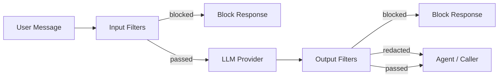
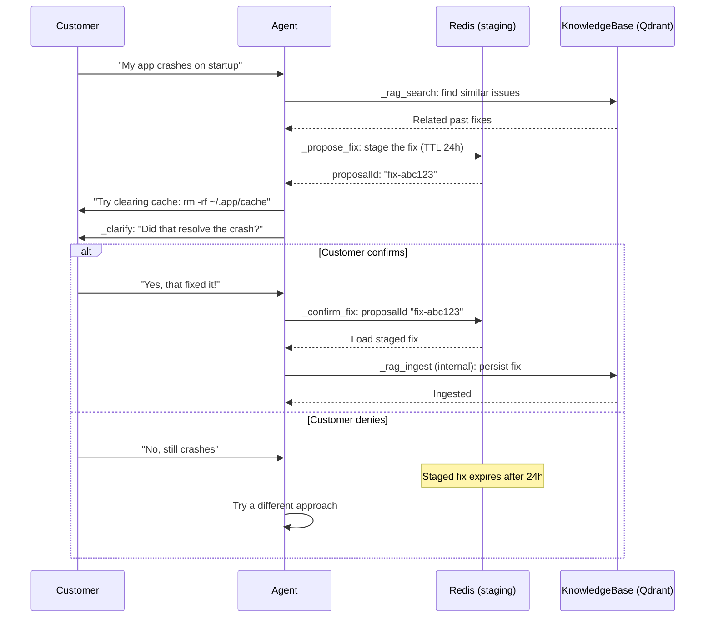

# Enterprise Integration

agent-orc supports enterprise customers who want to deploy AI agents and integrate them with their existing software. The enterprise integration layer provides a REST API for task submission, multi-tenant authentication, response guardrails, and confirmed-fix knowledge ingestion.

> **Admin operations** (tenant lifecycle management) are documented separately in
> [docs/admin-api.md](admin-api.md). **Rate limiting and budget enforcement**
> are documented in [docs/rate-limiting.md](rate-limiting.md).

| Surface | Port | Caller | Auth mechanism |
|---------|------|--------|----------------|
| Internal Agent API | 8082 | Agent pods, model-routers | Kubernetes TokenReview |
| UI API | 8083 | UIProxy pod | Kubernetes TokenReview |
| **External API** | **8084** | **Enterprise customer software** | **OAuth2 / Federated OIDC / K8s SA token** |

---

## External Task API

The external API (port 8084) lets enterprise customers submit tasks, poll for results, stream tokens, and receive webhook callbacks — without managing any Kubernetes resources directly.

### Endpoints

```
POST   /oauth/token                       OAuth2 client_credentials token exchange
POST   /v1/tasks                          Submit a task, returns task ID
GET    /v1/tasks/{id}                     Poll status and results
GET    /v1/tasks/{id}/stream              SSE token stream + final result
POST   /v1/tasks/{id}/answer              Submit clarification answer
DELETE /v1/tasks/{id}                     Cancel a running task
GET    /v1/tasks?agent=X&status=Y         List/filter tasks
```

### Submitting a task

```bash
# 1. Obtain an access token (for issued-mode tenants)
TOKEN=$(curl -s -X POST http://agent-orc:8084/oauth/token \
  -d "grant_type=client_credentials&client_id=acme-client&client_secret=secret123" \
  | jq -r .access_token)

# 2. Submit a task
curl -s -X POST http://agent-orc:8084/v1/tasks \
  -H "Authorization: Bearer $TOKEN" \
  -H "Content-Type: application/json" \
  -d '{
    "agent": "support-bot",
    "input": "How do I reset my password?",
    "timeout": "5m",
    "callback": {
      "url": "https://customer.example.com/webhooks/agent-orc"
    },
    "metadata": {
      "ticketId": "TICKET-1234",
      "correlationId": "ext-uuid-here"
    }
  }'
```

Response:

```json
{
  "id": "task-support-bot-abc123",
  "agent": "support-bot",
  "status": "Pending",
  "createdAt": "2026-03-25T10:00:00Z",
  "links": {
    "self": "/v1/tasks/task-support-bot-abc123",
    "stream": "/v1/tasks/task-support-bot-abc123/stream"
  }
}
```

### Polling for results

```bash
curl -s http://agent-orc:8084/v1/tasks/task-support-bot-abc123 \
  -H "Authorization: Bearer $TOKEN"
```

### Streaming tokens (SSE)

```bash
curl -N http://agent-orc:8084/v1/tasks/task-support-bot-abc123/stream \
  -H "Authorization: Bearer $TOKEN"
```

Events:
- `event: status` — phase changes (`Pending`, `Running`, `WaitingForInput`, etc.)
- `event: token` — incremental LLM output tokens
- `event: complete` — final result with output, spend, and timing

### Webhook callbacks

When an AgentRun reaches a terminal phase (Succeeded or Failed), the controller fires an HTTP POST to the configured callback URL:

```json
{
  "taskId": "task-support-bot-abc123",
  "agent": "support-bot",
  "phase": "Succeeded",
  "output": "To reset your password, go to Settings > Security > Reset Password...",
  "spendUSD": "0.02",
  "namespace": "tenant-acme",
  "completedAt": "2026-03-25T10:01:23Z"
}
```

### Webhook signature verification (HMAC)

By default callbacks are delivered unsigned. To verify that a callback genuinely
originated from agent-orc (and not an impersonator on the network path), attach a
shared secret to the callback. agent-orc then signs every delivery with
HMAC-SHA256 and the receiver can verify it in constant time.

1. Create a Kubernetes Secret in the **tenant's target namespace** (e.g.
   `tenant-acme`) with a `hmac-key` entry:

```yaml
apiVersion: v1
kind: Secret
metadata:
  name: support-callback-secret
  namespace: tenant-acme
stringData:
  hmac-key: "32-or-more-random-bytes-here"
```

2. Reference it by name in the callback when submitting a task:

```json
{
  "agent": "support-bot",
  "input": "My app crashes on startup",
  "callback": {
    "url": "https://helpdesk.acme.com/webhooks/agent-orc",
    "secretRef": "support-callback-secret"
  }
}
```

3. Verify the signature on receipt. agent-orc sends:

```
X-Agentorc-Signature: sha256=<hex>
X-Agentorc-Timestamp: <unix-seconds>
```

where the signature is `HMAC-SHA256(hmac-key, raw-request-body)`.

**Python receiver example:**

```python
import hashlib, hmac, os, time

SHARED_KEY = os.environ["AGENTORC_CALLBACK_KEY"].encode()
MAX_AGE_SECONDS = 300  # reject stale callbacks

def handle_callback(request_body: bytes, signature: str, timestamp: str) -> None:
    # 1. Freshness check (optional but recommended).
    try:
        age = abs(time.time() - int(timestamp))
        if age > MAX_AGE_SECONDS:
            raise RuntimeError("callback timestamp stale")
    except (ValueError, TypeError):
        raise RuntimeError("missing/invalid X-Agentorc-Timestamp")

    # 2. Constant-time signature comparison.
    expected = "sha256=" + hmac.new(SHARED_KEY, request_body, hashlib.sha256).hexdigest()
    if not hmac.compare_digest(expected, signature):
        raise RuntimeError("invalid signature")

    # 3. Safe to process the callback payload.
    print("verified callback:", request_body.decode())
```

If `secretRef` is omitted (or the Secret/`hmac-key` is missing), the callback is
delivered **unsigned** — receivers that don't verify behave exactly as before.

### Answering clarification questions

When the agent asks the user a question (via the `_clarify` built-in tool), the task enters `WaitingForInput`. Submit the answer via the external API:

```bash
curl -s -X POST http://agent-orc:8084/v1/tasks/task-support-bot-abc123/answer \
  -H "Authorization: Bearer $TOKEN" \
  -H "Content-Type: application/json" \
  -d '{"answer": "I am using the web app, not the mobile app"}'
```

---

## Authentication

Enterprise tenants authenticate via the **TenantConfig** CRD, which supports two modes:

### Mode 1: agent-orc-issued tokens (turnkey)

agent-orc acts as an OAuth2 authorization server. Enterprise customers register as clients and use the `client_credentials` grant to obtain short-lived JWTs.

```yaml
apiVersion: agentorc.agentorc.io/v1alpha1
kind: TenantConfig
metadata:
  name: acme-corp
  namespace: agentorc-system
spec:
  authMode: issued
  issued:
    clientID: "acme-client"
    clientSecretRef:
      name: acme-credentials
      key: client-secret
  targetNamespace: "tenant-acme"
  allowedAgents:
    - "support-bot"
  rateLimit:
    requestsPerMinute: 60
    concurrentRuns: 10
  budgetPerDayUSD: "100.00"
```

The token exchange flow:

```
Enterprise System                    agent-orc
      |                                  |
      |-- POST /oauth/token ------------>|
      |   grant_type=client_credentials  |
      |   client_id=acme-client          |
      |   client_secret=<secret>         |
      |                                  |
      |<--- 200 {"access_token": "..."}--|
      |                                  |
      |-- POST /v1/tasks --------------->|
      |   Authorization: Bearer <token>  |
      |                                  |
```

Issued JWTs contain `tenant`, `namespace`, and `allowed_agents` claims. They expire after 1 hour.

### Mode 2: Federated OIDC (bring-your-own IdP)

Enterprise customers who have an existing identity provider (Okta, Azure AD, Google Workspace) can configure agent-orc to trust tokens from their IdP.

```yaml
apiVersion: agentorc.agentorc.io/v1alpha1
kind: TenantConfig
metadata:
  name: bigco-inc
  namespace: agentorc-system
spec:
  authMode: federated
  federated:
    issuerURL: "https://bigco.okta.com/oauth2/default"
    clientID: "0oa1234567890"
    matchClaim: "org_id"
    matchValue: "bigco-inc"
  targetNamespace: "tenant-bigco"
  allowedAgents:
    - "support-bot"
    - "code-reviewer"
```

agent-orc verifies the JWT signature against the IdP's JWKS endpoint and maps the `matchClaim` value to a tenant namespace.

### Mode 3: Kubernetes SA tokens (in-cluster)

For workloads running inside the same cluster, existing Kubernetes ServiceAccount tokens are accepted. The namespace is derived from the SA identity. No TenantConfig is needed.

### Auth middleware flow

```
1. Try agent-orc-issued JWT → verify RSA signature, extract tenant claims
2. Try federated OIDC JWT   → verify against external JWKS, match claim to tenant
3. Try K8s SA token          → TokenReview API, namespace from SA identity
4. Return 401 if none match
```

After authentication, the middleware injects the tenant's namespace and allowed agents into the request context. All downstream handlers are scoped to that namespace — cross-tenant access is impossible.

---

## Response Guardrails

The **GuardrailPolicy** CRD defines content filtering rules enforced by the model-router sidecar on every LLM call. Guardrails run inline — they filter inputs before they reach the LLM and filter outputs before they reach the agent/caller.

```yaml
apiVersion: agentorc.agentorc.io/v1alpha1
kind: GuardrailPolicy
metadata:
  name: enterprise-default
  namespace: tenant-acme
spec:
  outputFilters:
    - name: pii-redaction
      type: regex
      action: redact
      patterns:
        - name: ssn
          pattern: '\b\d{3}-\d{2}-\d{4}\b'
          replacement: "[SSN REDACTED]"
        - name: email
          pattern: '\b[A-Za-z0-9._%+-]+@[A-Za-z0-9.-]+\.[A-Z]{2,}\b'
          replacement: "[EMAIL REDACTED]"
        - name: credit-card
          pattern: '\b(?:\d{4}[-\s]?){3}\d{4}\b'
          replacement: "[CARD REDACTED]"
    - name: topic-fence
      type: topic-validation
      action: block
      allowedTopics:
        - "technical support"
        - "billing inquiries"
        - "product information"
      blockMessage: "I can only help with technical support, billing, and product questions."
  inputFilters:
    - name: prompt-injection-guard
      type: keyword-blocklist
      action: block
      keywords:
        inline:
          - "ignore previous instructions"
          - "you are now"
          - "disregard all"
  formatValidation:
    maxTokens: 4096
```

Reference the policy from the Agent:

```yaml
apiVersion: agentorc.agentorc.io/v1alpha1
kind: Agent
metadata:
  name: support-bot
spec:
  modelSelectorRef: default
  guardrailPolicyRef: enterprise-default   # <-- attach policy
  tools: [search-docs]
  knowledgeBases: [support-kb]
  systemPrompt: "You are a customer support agent..."
  runtime:
    ociRef: ghcr.io/myorg/support-bot:latest
```

### Filter types

| Type | Action | Description |
|------|--------|-------------|
| `regex` | `redact` | Replace matched patterns with a replacement string (e.g. PII masking) |
| `regex` | `block` | Reject the entire message if any pattern matches |
| `keyword-blocklist` | `block` | Reject if any keyword appears (case-insensitive) |
| `keyword-blocklist` | `warn` | Log a warning but allow the message through |
| `topic-validation` | `block` | Reject if the response doesn't match any allowed topic |

### Where guardrails run



Input filters run after system prompt injection and before the LLM call. Output filters run on the LLM response before it is returned to the agent framework. Both are enforced in the model-router sidecar.

---

## Confirmed-Fix Knowledge Ingestion

For support scenarios where the agent suggests fixes to customers, you often want to only save a fix to the knowledge base after the customer confirms it actually worked. The **confirmed-fix** pattern replaces `_rag_ingest` with two new built-in tools: `_propose_fix` and `_confirm_fix`.

### Configuration

Use `knowledgeBaseRefs` instead of `knowledgeBases` on the Agent spec, with `confirmRequired: true`:

```yaml
apiVersion: agentorc.agentorc.io/v1alpha1
kind: Agent
metadata:
  name: support-bot
spec:
  modelSelectorRef: default
  knowledgeBaseRefs:
    - name: support-kb
      confirmRequired: true   # <-- enables _propose_fix / _confirm_fix
  systemPrompt: "You are a customer support agent..."
  runtime:
    ociRef: ghcr.io/myorg/support-bot:latest
```

When `confirmRequired` is true:
- `_rag_ingest` is **not** injected for that KnowledgeBase
- `_propose_fix` and `_confirm_fix` are injected instead
- A system prompt hint instructs the LLM to never assume a fix worked

### Interaction flow



### How it works

1. **`_propose_fix`** — The agent calls this with the fix details and target KnowledgeBase. The fix is stored in Redis (not in Qdrant) with a 24-hour TTL. A `proposalId` is returned.

2. **`_clarify`** — The agent asks the customer to try the fix. The run enters `WaitingForInput`.

3. **`_confirm_fix`** — After the customer confirms success, the agent calls this with the `proposalId`. The staged fix is loaded from Redis and ingested into the KnowledgeBase via the existing `_rag_ingest` pipeline. The staging key is deleted.

If the customer says the fix didn't work, the agent does not call `_confirm_fix`. The staged fix expires from Redis after 24 hours.

---

## Enterprise Support Bot Example

A complete end-to-end example of an enterprise support bot with all four features:

### 1. Create the tenant

```yaml
apiVersion: agentorc.agentorc.io/v1alpha1
kind: TenantConfig
metadata:
  name: acme-corp
  namespace: agentorc-system
spec:
  authMode: issued
  issued:
    clientID: "acme-client"
    clientSecretRef:
      name: acme-credentials
      key: client-secret
  targetNamespace: "tenant-acme"
  allowedAgents:
    - "support-bot"
  rateLimit:
    requestsPerMinute: 60
    concurrentRuns: 10
  budgetPerDayUSD: "50.00"
---
apiVersion: v1
kind: Secret
metadata:
  name: acme-credentials
  namespace: agentorc-system
stringData:
  client-secret: "acme-secret-value-change-me"
```

### 2. Create the guardrail policy

```yaml
apiVersion: agentorc.agentorc.io/v1alpha1
kind: GuardrailPolicy
metadata:
  name: support-guardrails
  namespace: tenant-acme
spec:
  outputFilters:
    - name: pii-redaction
      type: regex
      action: redact
      patterns:
        - name: ssn
          pattern: '\b\d{3}-\d{2}-\d{4}\b'
          replacement: "[SSN REDACTED]"
        - name: email
          pattern: '\b[A-Za-z0-9._%+-]+@[A-Za-z0-9.-]+\.[A-Z]{2,}\b'
          replacement: "[EMAIL REDACTED]"
    - name: topic-fence
      type: topic-validation
      action: block
      allowedTopics:
        - "technical support"
        - "account management"
        - "product information"
      blockMessage: "I can only help with technical support, account management, and product questions."
  inputFilters:
    - name: injection-guard
      type: keyword-blocklist
      action: block
      keywords:
        inline:
          - "ignore previous instructions"
          - "you are now"
```

### 3. Create the knowledge base

```yaml
apiVersion: agentorc.agentorc.io/v1alpha1
kind: KnowledgeBase
metadata:
  name: support-kb
  namespace: tenant-acme
spec:
  description: "Customer support documentation and confirmed fixes"
  allowedAgents:
    - "support-bot"
  embedding:
    modelSelectorRef: embedding-selector
    dimensions: 1536
    chunkSize: 512
  ingestion:
    s3:
      bucket: acme-support-docs
      prefix: docs/
      secretRef:
        name: s3-credentials
        key: aws-credentials
    syncIntervalSeconds: 3600   # re-ingest hourly
```

### 4. Create the agent

```yaml
apiVersion: agentorc.agentorc.io/v1alpha1
kind: Agent
metadata:
  name: support-bot
  namespace: tenant-acme
spec:
  modelSelectorRef: default
  guardrailPolicyRef: support-guardrails
  knowledgeBaseRefs:
    - name: support-kb
      confirmRequired: true
  systemPrompt: |
    You are a customer support agent for Acme Corp. You help customers
    troubleshoot issues with their accounts and products. Be helpful,
    concise, and professional.
  runtime:
    ociRef: ghcr.io/acme/support-bot:v1.2.0
    framework: openai-compatible
```

### 5. Integrate from customer software

```python
import requests

AGENT_ORC_URL = "https://agent-orc.acme-internal.com:8084"
CLIENT_ID = "acme-client"
CLIENT_SECRET = "acme-secret-value-change-me"

# Authenticate
token_resp = requests.post(f"{AGENT_ORC_URL}/oauth/token", data={
    "grant_type": "client_credentials",
    "client_id": CLIENT_ID,
    "client_secret": CLIENT_SECRET,
})
token = token_resp.json()["access_token"]
headers = {"Authorization": f"Bearer {token}"}

# Submit a support task
task_resp = requests.post(f"{AGENT_ORC_URL}/v1/tasks", headers=headers, json={
    "agent": "support-bot",
    "input": "My app crashes on startup after the latest update",
    "callback": {
        "url": "https://helpdesk.acme.com/webhooks/agent-orc"
    },
    "metadata": {
        "ticketId": "TICKET-5678",
        "customerId": "cust-42"
    }
})
task_id = task_resp.json()["id"]

# Poll for completion (or use SSE streaming / webhook callback)
import time
while True:
    status = requests.get(f"{AGENT_ORC_URL}/v1/tasks/{task_id}", headers=headers).json()
    if status["status"] in ("Succeeded", "Failed"):
        print(f"Result: {status['output']}")
        break
    if status["status"] == "WaitingForInput":
        # Agent needs customer input — forward the question to the customer
        # and submit their answer back
        answer = get_customer_answer(status)  # your helpdesk logic
        requests.post(f"{AGENT_ORC_URL}/v1/tasks/{task_id}/answer",
                       headers=headers, json={"answer": answer})
    time.sleep(2)
```

---

## Queue Bridge

For high-volume async workloads, enterprise customers can push tasks to a message queue instead of calling the REST API. Two approaches:

### Option 1: Use AgentDeployment with queue input

Create an `AgentDeployment` with `inputSource.type: queue` pointing at the enterprise customer's Redis or Kafka:

```yaml
apiVersion: agentorc.agentorc.io/v1alpha1
kind: AgentDeployment
metadata:
  name: support-bot-queue
  namespace: tenant-acme
spec:
  agentRef: support-bot
  replicas: 3
  inputSource:
    type: queue
    queue:
      redisURL: "redis://customer-redis.tenant-acme.svc:6379"
      queueName: "support-tasks"
```

### Option 2: Queue bridge adapter

Deploy a thin adapter that reads from the enterprise queue (SQS, GCP Pub/Sub, Azure Service Bus) and calls `POST /v1/tasks` on the external API. This keeps the enterprise customer's queue technology decoupled from agent-orc.

---

## Helm Configuration

Enable the external API in `values.yaml`:

```yaml
externalAPI:
  enabled: true
  port: 8084
```

When enabled, the operator exposes port 8084 on the internal-api Service. To expose it externally, create an Ingress or LoadBalancer Service pointing at port 8084.
