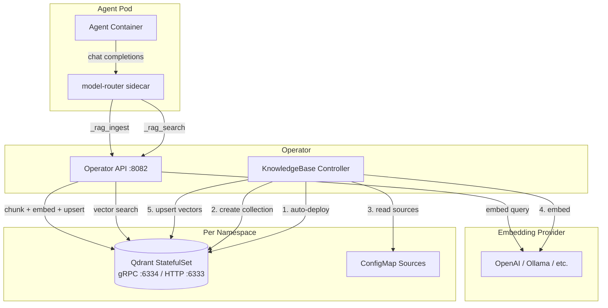

# RAG Integration (KnowledgeBase)

agent-orc provides native Retrieval-Augmented Generation through the **KnowledgeBase** CRD. When an Agent references a KnowledgeBase, the model-router automatically injects `_rag_search` and `_rag_ingest` as built-in tools, giving the LLM direct access to vector search and runtime document ingestion.

---

## Architecture



---

## KnowledgeBase CRD

```yaml
apiVersion: agentorc.agentorc.io/v1alpha1
kind: KnowledgeBase
metadata:
  name: my-kb
spec:
  description: "Project documentation"
  vectorStore:
    provider: qdrant          # only supported provider
    collectionName: my-kb     # defaults to CR name
    storageSize: "10Gi"       # PVC size for Qdrant
  embedding:
    modelSelectorRef: local-embeddings   # ModelSelector for /v1/embeddings calls
    chunkSize: 512                       # tokens per chunk
    chunkOverlap: 64                     # overlap tokens between chunks
  ingestion:
    configMapRefs:
      - name: my-docs                    # ConfigMap keys → documents
    urls:
      - https://example.com/docs.txt     # fetched at reconcile time
    syncIntervalSeconds: 3600            # 0 = one-shot, >0 = periodic re-sync
```

### Status

```yaml
status:
  ready: true
  vectorStoreURL: "kb-qdrant-my-kb.default.svc.cluster.local:6334"
  collectionName: "my-kb"
  documentCount: 3
  chunkCount: 12
  lastSyncTime: "2026-03-22T10:00:00Z"
```

---

## Connecting an Agent to a KnowledgeBase

Add the KnowledgeBase name to the Agent's `knowledgeBases` field:

```yaml
apiVersion: agentorc.agentorc.io/v1alpha1
kind: Agent
metadata:
  name: research-agent
spec:
  modelSelectorRef: default
  knowledgeBases:
    - my-kb
  systemPrompt: |
    You are a research assistant. Use _rag_search to find relevant
    information before answering questions.
  runtime:
    ociRef: ghcr.io/myorg/research-agent:latest
```

When `knowledgeBases` is non-empty, the operator automatically injects two built-in tools into the router config:

| Tool | Description |
|------|-------------|
| `_rag_search` | Embed a query and return the top-K most relevant chunks |
| `_rag_ingest` | Ingest new documents at runtime (chunk → embed → upsert) |

---

## Built-in Tools

### `_rag_search`

```json
{
  "knowledgeBase": "my-kb",
  "query": "How does the model-router handle authentication?",
  "topK": 5
}
```

Returns an array of results with `score`, `text`, `doc_id`, `chunk_index`, and any metadata.

### `_rag_ingest`

```json
{
  "knowledgeBase": "my-kb",
  "documents": [
    {
      "id": "meeting-notes-2026-03-22",
      "content": "Discussed new RAG integration...",
      "metadata": {"source": "meeting", "date": "2026-03-22"}
    }
  ]
}
```

Returns `{"ingested": 1, "chunks": 3}`.

---

## Local Development Setup

This guide walks through testing RAG on a local kind cluster using Ollama for embeddings.

### Prerequisites

- [kind](https://kind.sigs.k8s.io/) (or any local Kubernetes cluster)
- [Ollama](https://ollama.com/) installed on macOS
- Docker Desktop

### Step 1: Create a kind cluster

```bash
kind create cluster
```

### Step 2: Install and configure Ollama

```bash
brew install ollama
ollama pull nomic-embed-text
```

Ollama runs natively on your Mac (Apple Silicon optimized) and serves `/v1/embeddings` on `localhost:11434`.

### Step 3: Bridge Ollama into the cluster

Since Ollama runs on the host (not inside kind), create a Service + Endpoints bridge:

```bash
kubectl apply -f config/samples/ollama-embedding-bridge.yaml
```

This creates a `ollama` Service in the `default` namespace that forwards traffic to your host's Ollama instance. You may need to update the IP in the Endpoints resource:

```bash
# Find your Docker gateway IP
docker run --rm alpine nslookup host.docker.internal
# Update the IP in ollama-embedding-bridge.yaml if it differs from 192.168.65.254
```

### Step 4: Install CRDs

```bash
make install
```

### Step 5: Apply the demo KnowledgeBase

```bash
kubectl apply -f config/samples/knowledgebase-demo.yaml
```

This creates:
- A **Secret** with a dummy API key (Ollama doesn't need auth)
- A **ModelProvider** (`ollama-embed`) pointing at `nomic-embed-text` with `baseURL: http://ollama.default.svc:11434`
- A **ModelSelector** (`local-embeddings`) routing to the Ollama provider
- A **ConfigMap** (`demo-knowledge`) with 3 sample documents
- A **KnowledgeBase** (`demo-kb`) with ConfigMap ingestion (dimensions auto-discovered from the model)

### Step 6: Run the operator

```bash
make run
```

The KnowledgeBase controller will:
1. Create a dedicated `kb-qdrant-demo-kb` StatefulSet + headless Service
2. Probe the embedding model, discover its output dimension, create the `demo-kb` collection
3. Read the `demo-knowledge` ConfigMap
4. Chunk the 3 documents, embed via Ollama, upsert into Qdrant
5. Update status with `ready: true`, document/chunk counts

### Step 7: Verify

```bash
# Check KnowledgeBase status
kubectl get knowledgebase demo-kb -o yaml

# Check Qdrant is running (each KB gets its own StatefulSet)
kubectl get statefulset kb-qdrant-demo-kb
kubectl get svc kb-qdrant-demo-kb

# Check Qdrant has data (port-forward to HTTP API)
kubectl port-forward svc/kb-qdrant-demo-kb 6333:6333
curl http://localhost:6333/collections/demo-kb
```

---

## Access Control

Each KnowledgeBase manages its own access list via `spec.allowedAgents`. Access is
**denied by default** — an agent can only use a KnowledgeBase if its name appears in
the list, regardless of what the agent's `spec.knowledgeBases` field declares.

```yaml
apiVersion: agentorc.agentorc.io/v1alpha1
kind: KnowledgeBase
metadata:
  name: my-kb
spec:
  allowedAgents:
    - rag-assistant
    - search-agent
  embedding:
    modelSelectorRef: embeddings
```

The operator enforces this at two points:
1. **AgentRun/AgentDeployment creation time** — the run is rejected before the pod is scheduled if the agent is not in `allowedAgents`.
2. **Runtime** — the operator API verifies the calling agent's SA identity via TokenReview and returns `403 Forbidden` for unauthorised requests.

---

## Migration from Shared Qdrant

Prior to this change, all KnowledgeBases in a namespace shared a single `agentorc-qdrant`
StatefulSet. The legacy StatefulSet is **not deleted** by the operator — existing clusters
keep their data intact. New KnowledgeBases (and re-creates of existing ones) will receive
their own dedicated `kb-qdrant-<name>` instance.

To migrate existing data, port-forward the old instance, export collections via the Qdrant
snapshot API, and import them into the new per-KB instance.

---

## ModelProvider `baseURL` Field

For self-hosted models (Ollama, vLLM, etc.), set `baseURL` on the ModelProvider to override the default endpoint derived from the LiteLLM model prefix:

```yaml
apiVersion: agentorc.agentorc.io/v1alpha1
kind: ModelProvider
metadata:
  name: ollama-embed
spec:
  litellmModel: "ollama/nomic-embed-text"
  baseURL: "http://ollama.default.svc:11434"   # overrides default localhost:11434
  credentialsRef:
    name: ollama-credentials
    key: api-key
```

Without `baseURL`, the operator maps prefixes to default endpoints:

| Prefix | Default Endpoint |
|--------|-----------------|
| `openai/` | `https://api.openai.com` |
| `ollama/` | `http://localhost:11434` |
| `gemini/` | `https://generativelanguage.googleapis.com/v1beta/openai` |

Setting `baseURL` is required when the model runs in-cluster rather than on localhost.

---

## Embedding Models

Any model that serves an OpenAI-compatible `/v1/embeddings` endpoint works. Common options:

| Model | Provider | Dimensions | Notes |
|-------|----------|-----------|-------|
| `nomic-embed-text` | Ollama | 768 | Free, runs locally on Apple Silicon |
| `text-embedding-3-small` | OpenAI | 1536 | Low cost, good quality |
| `text-embedding-3-large` | OpenAI | 3072 | Higher quality, higher cost |

The `dimensions` field no longer exists in the KnowledgeBase spec. The controller probes the
embedding model on first use and stores the discovered dimension in `status.embeddingDimensions`.

---

## How It Works Internally

### Ingestion Pipeline

```
Source Documents → Chunk (sentence-boundary, token-based) → Embed (batch /v1/embeddings) → Upsert (Qdrant gRPC)
```

1. **Chunking**: Splits on sentence boundaries, respecting `chunkSize` tokens with `chunkOverlap` overlap. Uses word count as a token approximation (1 token ~ 1.33 words).
2. **Embedding**: Batches up to 100 texts per `/v1/embeddings` call.
3. **Upsert**: Each chunk gets a deterministic ID (`sha256(docID:chunkIndex)`), enabling idempotent re-ingestion. Points include payload: `text`, `doc_id`, `chunk_index`, plus any user metadata.

### Search Flow

```
Query → Embed → Qdrant nearest-neighbor (cosine) → Top-K chunks with scores
```

### Key Files

| File | Role |
|------|------|
| `api/v1alpha1/knowledgebase_types.go` | KnowledgeBase CRD types |
| `internal/rag/qdrant.go` | Qdrant gRPC client wrapper |
| `internal/rag/embedding.go` | OpenAI-compatible embedding client |
| `internal/rag/chunker.go` | Sentence-boundary document chunker |
| `internal/rag/pipeline.go` | Shared ingest pipeline (chunk → embed → upsert) |
| `internal/controller/knowledgebase_controller.go` | Reconciler: Qdrant deploy, collection create, source ingestion |
| `internal/apiserver/apiserver.go` | `/knowledgebase/.../search` and `/knowledgebase/.../ingest` handlers |
| `internal/controller/agentrun_controller.go` | Resolves KB configs + injects RAG tools in `buildRouterConfig` |

---

## Integration Test

A standalone integration test exercises the full pipeline without Kubernetes:

```bash
# Prerequisites: Qdrant on localhost:6334, Ollama with nomic-embed-text
docker run -d --name qdrant -p 6333:6333 -p 6334:6334 qdrant/qdrant:v1.17.1
ollama pull nomic-embed-text

# Run the test
go test -tags integration -v ./internal/rag/ -run TestRAGEndToEnd
```

The test ingests 3 documents, runs semantic queries, and verifies the top results match expected topics.
